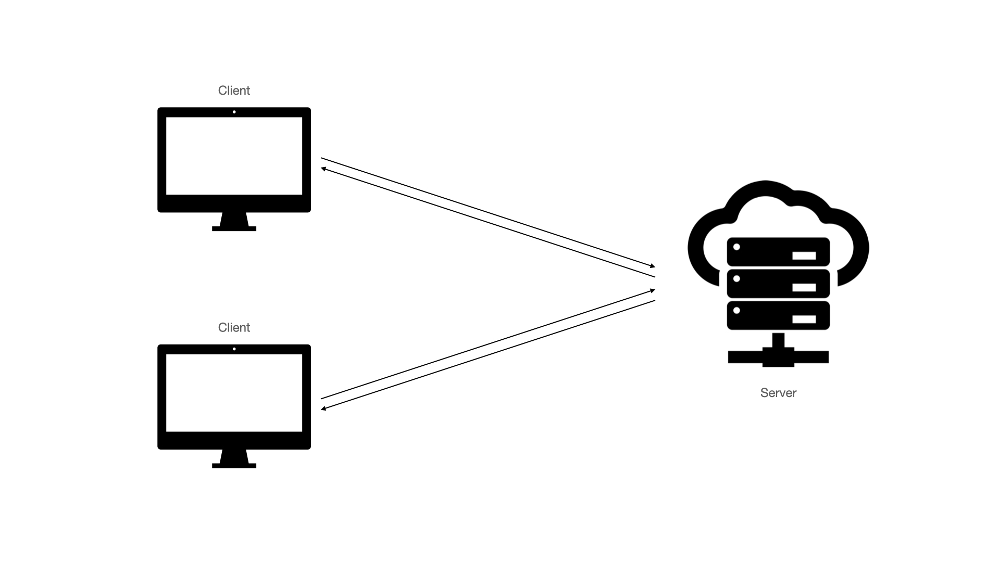
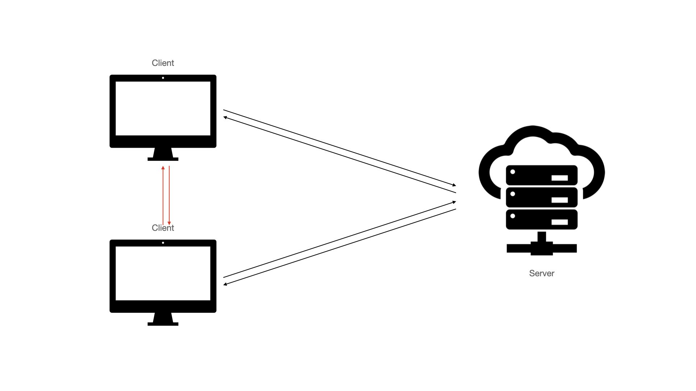
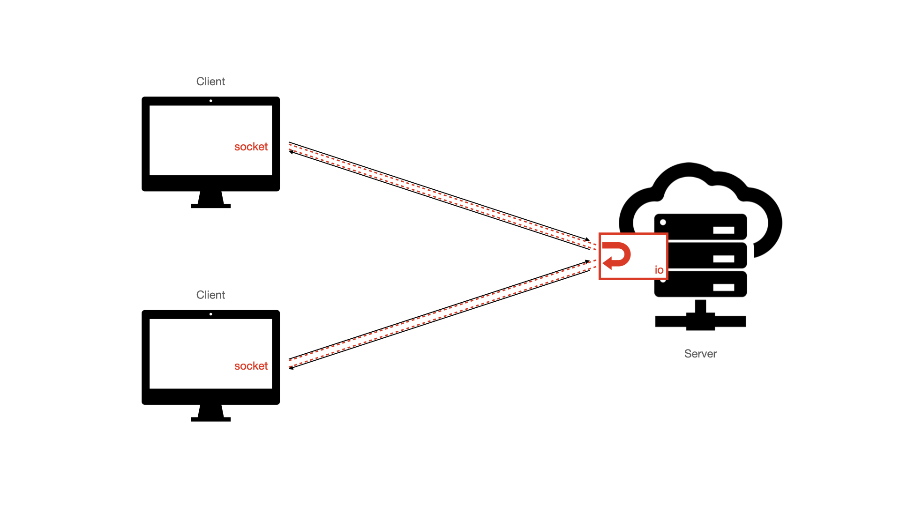
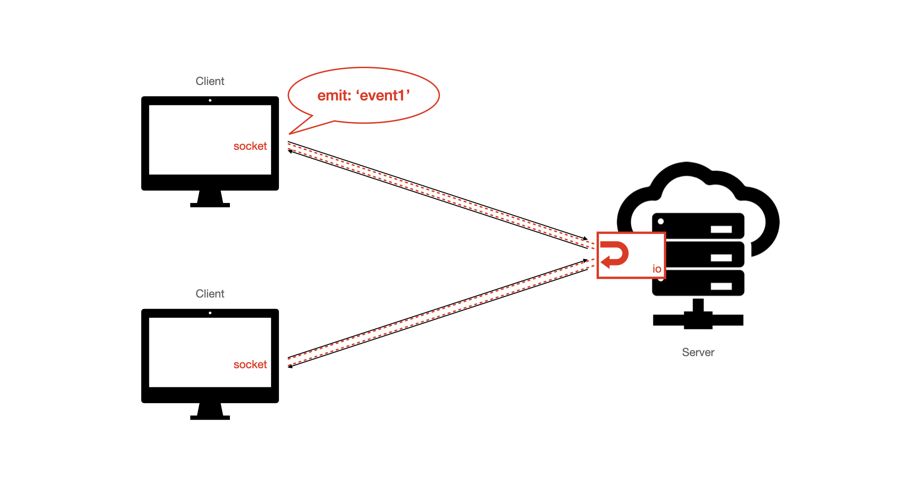
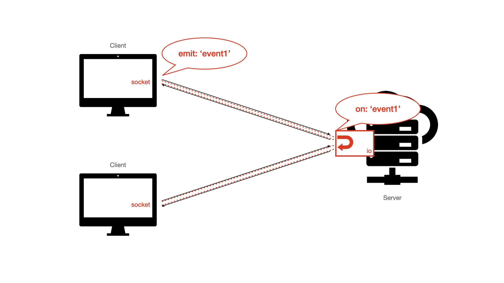
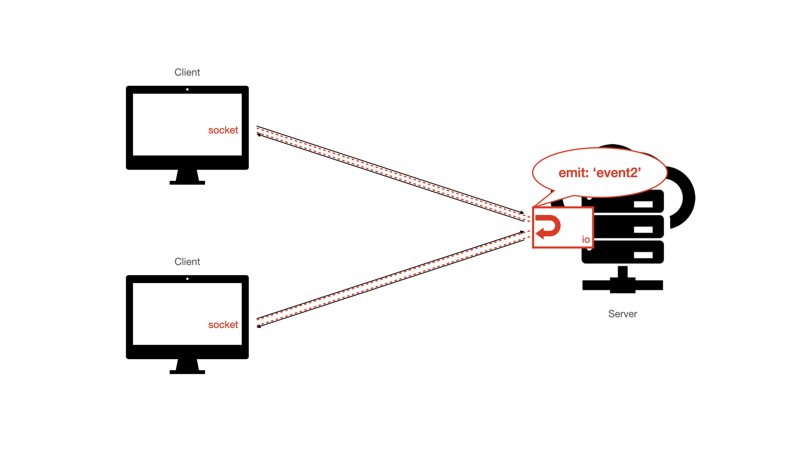
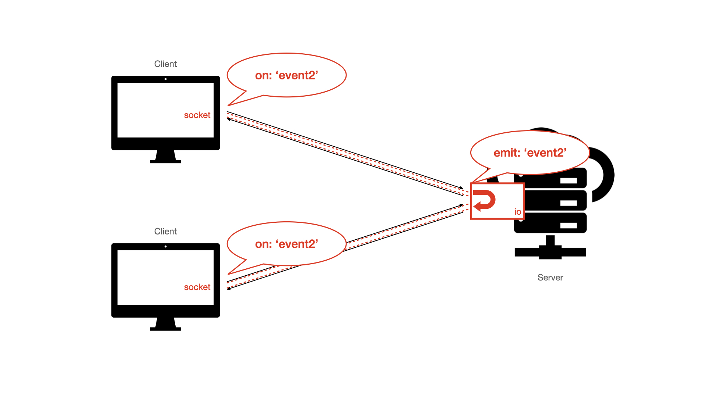
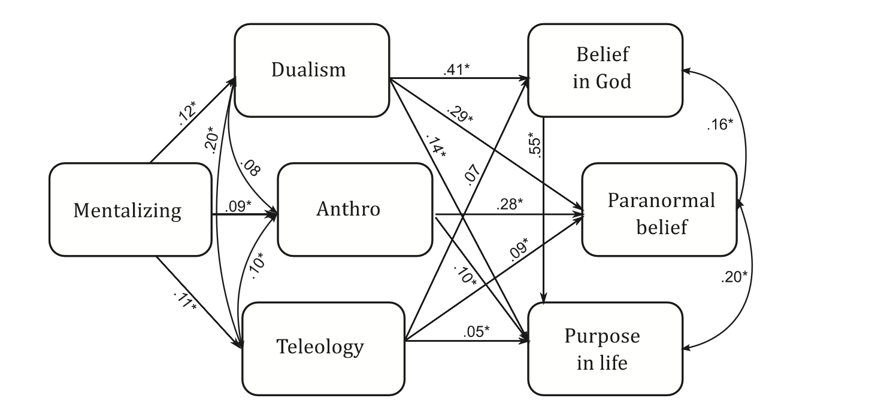

## Outline

- Practical: adding interaction to studies
- Theoretical: Mind

## Interaction with sockets

- Previously we had something like this:



## Interaction with sockets

- But what if we want the clients to be able to talk to each other? Something like this:



## Interaction with sockets

- Obviously they are not connected to each other directly, only indirectly via the server
- The server can handle incoming/outgoing messages so it could get a message fromm one client and pass it on to another
- Socket.io is just a package that handles and streamlines this process

## Interaction with sockets

- Socket.io is just a bit of code that is included with the server script
- You can think of *io* as a bit of the server that listens to each connected client or *socket*
- It's like a pipeline so that if one client does something, other clients can be informed about it



## Interaction with sockets

- The key thing is events (someone connects, a message is sent, someone disconnects, someone starts typing, someone has finished task, ...)
- Whenever an event happens, the client or server can *emit* a message



## Interaction with sockets

- The key thing is events (someone connects, a message is sent, someone disconnects, someone starts typing, someone has finished task, ...)
- Anything connected will notice those events, and respond (*on* noticing an event, do something)




## Interaction with sockets

- You can think of cause/signal as "emit"
- And effect/response as "on"
- Both client/socket and server/io can cause and respond to events
- The event just needs a name (e.g., 'message sent')
- emit('message sent') causes the event
- on('message sent') reacts

## Interaction with sockets

- So, for instance, *on* receiving a message from one client, the server can then initiate a next step: *emit* that message to all connected clients



## Interaction with sockets

- In turn, *on* noticing that broadcast, all clients can now do something




## Practical example

- 'chat/index.js'
- Previously I said you can just name events whatever
- There are a couple predefined ones: 
  - 'connection' when anyone connects; 
  - 'disconnect' when anyone disconnects
  
## Practical example

- Each event can have data attached
- socket.on('send message', message)
- io.emit('send messge', message)
  
## Practical example 1

- Let's add some events:
 - A client disconnects
 - The server receives a message from the client
 - Track how many clients have connected
 
## Practical example 2

- Add the code below to the socket client `<script>`
- This means it is listening for a 'share message' event, so let's tell the server to emit one!

```
     socket.on('share message', function(msg) {
       var item = document.createElement('li');
       item.textContent = msg;
       messages.appendChild(item);
       window.scrollTo(0, document.body.scrollHeight);
     });
```

# Theory

## Mind

- We know we think
- We believe that other humans think

&rarr; We ascribe mental states to them
&rarr; Mentalizing

##  Mind

Some philosophical questions

- What are minds?
- What is consciousness?
- What are we doing when we ascribe mental states to others?
- What kinds of things have minds?
- ...

## The Plan

- Look at one X-phi paper on mentalizing
- Look at 2 cognitive science papers (one on religion, one on delusions) to get a different perspective on mentalizing
- I'm **not** drawing a link between the cog sci papers and this specific phil paper
  - Rather, you can learn about some tools that cog sci uses to study mentalizing
  - May be useful for expanding the scope and rigour of x-phi in this domain
  
## Intuitions

How do these sentences strike you?

- "The teacher has decided to cancel classes"
- "The university has decided to cancel classes"

## Intuitions

How do these sentences strike you?

- "The teacher feels happy"
- "The university feels happy"

## Intuitions

- In one case, it seems like we're ok using mentalizing language; in the other not
- Why the difference?
- Is it that we think people have X and universities don't?
- What is X?!?

## Knobe & Prinz (2008)

- Two types of explanations:
- Functional role (characterize causes/effects)
  - Is X a calculator? Well, if you put in 3+4 and 7 comes out, sure!
- Physical constitution (what kind of thing it is)

- Do ordinary people ascribe mental states on the basis of functional role or physical constitution?

## Knobe & Prinz (2008)

- Their claims: 
- people have a concept of "phenomenal consciousness"
- people use this when ascribing mental states
- their doing has something to do with physical constitution

## Phenomenal consciousness as a concept

- First, a worry:
- This kind of concept seems complex
- Explaining philosophy to lay-people is hard enough
- It seems absurd to claim that people have such a concept?

## Phenomenal consciousness as a concept

- It might be absurd for an explicit concept
- But there are tacit concepts
- Can inform judgments without being aware of criteria

## Phenomenal consciousness as a concept

- Compare:
  - "He's a professorial gentleman"
  - "He's a financial planner"
- With
  - "This gentleman is professorial"
  - "This planner is financial"

&rarr; people can  make consistent judgments and have intuitions without being able to explicitly account for them

## Do people ascribe phenomenal consciousness to groups?

Return to the motivating examples:

- "The teacher has decided to cancel classes"
- "The university has decided to cancel classes"

vs.

- "The teacher feels happy"
- "The university feels happy"

- They differ in physical constitution: individual agent vs group agent
- Perhaps the difference is that group agents don't have phenomenal consciousness?
  - The group isn't the right kind of thing to have some mental states, such as feelings
  - If so, then people shouldn't ascribe phenomenal states to groups

## Do people ascribe phenomenal consciousness to groups?

Google hits:

Non-phenomenal: 1000s

- "Microsoft intends"
- "Microsoft hates"
- "Microsoft beliefs"
- ...

Phenomenal: 0

- "Microsoft feels depressed"
- "Microsoft feels happy"
- "Microsoft feels scared"

## Do people ascribe phenomenal consciousness to groups?

How convincing do you find this as a *general strategy*?

How convincing do you find this *specific approach*?

## Do people ascribe phenomenal consciousness to groups?

Get participants to rate from 1=sounds weird to 7=sounds natural for "Acme corp."

Non-phenomenal states:

- 6.6: Deciding 
- 6.6: Wanting 
- 6.3: Intending 
- 6.1: Believing 
- 5.2: Knowing

Phenomenal states:

- 4.7: Experiencing a sudden urge 
- 3.7: Experiencing great joy
- 2.7: Vividly imagining
- 2.5: Getting depressed
- 2.1: Feeling excruciating pain

## Do people ascribe phenomenal consciousness to groups?

&rarr; people are unwilling to ascribe to group agents states that require phenomenal consciousness

&rarr; (as an aside, reporting a bunch of mean values is terrible practice)

- Aside from this terrible reporting: 

- How convincing do you find this as a *general strategy*?

- How convincing do you find this *specific approach*?

## What criteria are people using?

- Because groups are dissimilar to humans?
- Try rule that out:

"Once there was a powerful sorceress. She came upon an ordinary chair and cast a spell on it that endowed it with a mind. The chair was still just made of wood, but because of the magic spell, it could now think complex thoughts and form elaborate plans. It would make detailed requests to the people around it, and if they didn’t do everything just as it wanted, it would start complaining. People used to call it the Enchanted Chair."

- "Can the enchanted chair feel happy or sad?"

&rarr; It's not about dissimilarity to humans

## What criteria are people using?

How convincing do you find this?

- Note: phenomenal consciousness not mentioned in vignette

## What criteria are people using?

People happy to ascribe phenomenal states to the chair but not to Acme Corp. 

Two parts:

- Acme Corp. doesn't meet criteria for "upsetness" (whatever they are)
- Acme Corp. doesn't meet criteria for "phenomenal consciousness" (the feeling part of "feeling upset")

- How to test this?

## What criteria are people using?

- "Acme Corp. is feeling upset." (mean: 1.9)
- "Acme Corp. is upset about the court’s recent ruling." (mean: 5.3)

&rarr; it's the feeling part that's the barrier to ascription, not the upsetness

&rarr; uncovering a mechanism that specifically blocks the ascription of certain mental states

"people are perfectly willing to say that a group agent can be in a state of upsetness or regret. The problem is simply that it cannot feel upset or feel regret."
 
## Application

- Catch a fish, observe it squirming
- Lay-person's question: Does it feel pain? 
- Knobe & Prinz's question: Why would this lay-person wonder whether the fish feels pain?

&rarr; We often need to  make *moral judgements*
&rarr; Phenomenal consciousness plays a role in moral judgments

"when we are wondering whether to treat an entity with moral concern, we are not principally concerned with questions about whether this entity is capable of complex reasoning, planning or comprehension—what we really want to know is whether or not the entity is capable of having genuine feelings."

## Application

Give vignette; ask people for their hypotheses 

REMEMBERING CONDITION

"Imagine a person who has a job working with fish. He finds himself wanting to know the answer to a particular question about them. Specifically, he wants to know whether fish are capable of *remembering* which part of a lake has the most food."

CONSCIOUSNESS CONDITION

"Imagine a person who has a job working with fish. He finds himself wanting to know the answer to a particular question about them. Specifically, he wants to know whether fish are genuinely capable of *feeling* anything."

## Application

Example responses

REMEMBERING CONDITION

"So it will be easier to feed them, b/c he only has to distribute food in one place or so he’ll know where to go in order to give bait, if they are capable of remembering such things."

CONSCIOUSNESS CONDITION

"He might want to know whether fish genuinely feel things because in doing his job, he does lots of things to the fish that might possibly hurt them if they can really feel things. It might be important to him to find out if he causes them pain because he might feel it is unethical or immoral to cause harm to other things. He could hold this belief for several reasons such as religion."

## Summary

- Regarding a sentence like "George is feeling upset":
  - In ascribing this mental state, humans are less interested in causes/effects; more interested in physical constitution (and not in the sense "how similar to humans")
  - This interest is due to its facilitating moral judgment
  
## Ok, moving onto psych now...

- To reiterate: my aim here is not to draw comparisons with the previous x-phi paper
- Rather, it fits in with last week's point: let's move beyond vignettes

- Also: let's make sure we carefully control for things

## Ok, moving onto psych now...

- We have been talking as though this is just what ascription of mental states is
  - universal (this is just how it is)
  - "rational" (we want to make moral judgments, this facilitates moral judgments)

- But, as we've been discussing, there is a great deal of variation in intuitions
  - Also variation in mental state ascriptions
  - In reasons for those ascriptions  
  - On affordances of those ascriptions

## Clinical psychology of delusions

Fyfe et al. (2008) 

- Mentalizing tested with several tasks, including Triangles Task (3 conditions: random, physical, Theory of Mind)
  - Making ToM attributions in the random condition = over-mentalizing

- Delusional ideation, with items like "Do you ever feel as if people seem to drop hints about you or say things with a double meaning?"

- Over-mentalizing associated with delusions

"Perceiving meaning in randomness and, more particularly, attributing mental states where none are indicated, may be important factors in the formation of paranormal and delusional beliefs."

## Clinical psychology of delusions

Relevance?

- Just a heads up: there are lots of non-philosophical things that go into the question of why/how people mentalize

- Such ascriptions vary; their distribution has a particular shape
  - Just reporting means is very bad practicef
  
- These tools are potentially useful
  - How might you bring the Triangles Task to bear on a philosophically relevant question?

## Psychology of religion

Willard & Norenzayan (2013)

- mentalizing measured by Empathy Quotient ("I often find it difficult to judge if someone is rude or polite")

- anthropomorphic tendencies ("To what extent does the ocean have consciousness?", "To what extent do cows have intentions?")

- dualism ("The ‘self’ I introspect about controls both the mind and the brain")

- teleology ("Earthworms tunnel underground to aerate the soil", "The sun makes light so that plants can photosynthesize")

## Psychology of religion



## Psychology of religion

(I'm not here to sell you their explanation of religion)

- But they do bring up that there are many factors affecting mentalizing:
  - Mentalize more when lonely, want companionship
  - Mentalize when something behaves unpredictably
  

- And the results suggest there are many factors affected by mentalizing

## Psychology of religion


- Relevance?

- Many causes; many effects:
  - it's not so neat as saying "we ascribe mental states to things with phenomenal consciousness" (though *of course* nobody's claiming it's that simple)
  - It's not so simple as saying "it affords moral judgment" (though *of course* nobody's claiming it's that simple)

- Some nice tools/scales mentioned
  - Can be used as controls
  - How might you bring them to bear on a philosophically relevant question? 

## Homework

- Depending on your focus...
- Theory:
  - Read Knobe & Prinz (2008)
  - You needn't read Fyfe et al. or Willard & Norenzayan (they're just on the syllabus for the sake of reference)
  - Do a google Scholar search for someone who's cited Knobe & Prinz, either in a way that extends or criticizes them
  
- Practical:
  - Have a look at [https://socket.io/get-started/](https://socket.io/get-started/) for ideas to try
  - OR use your own imagination