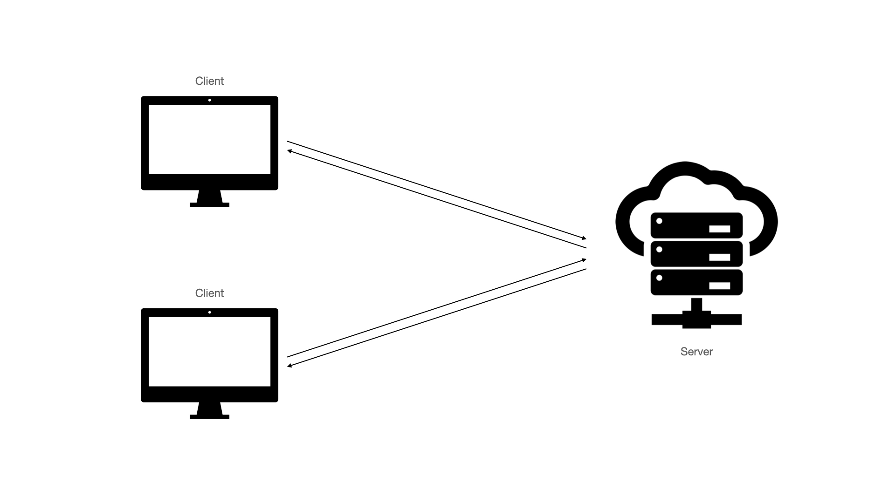
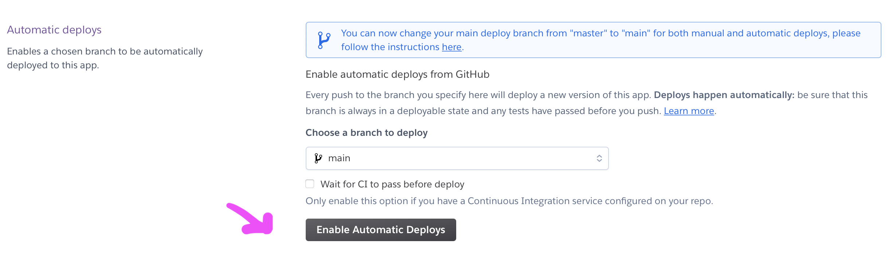
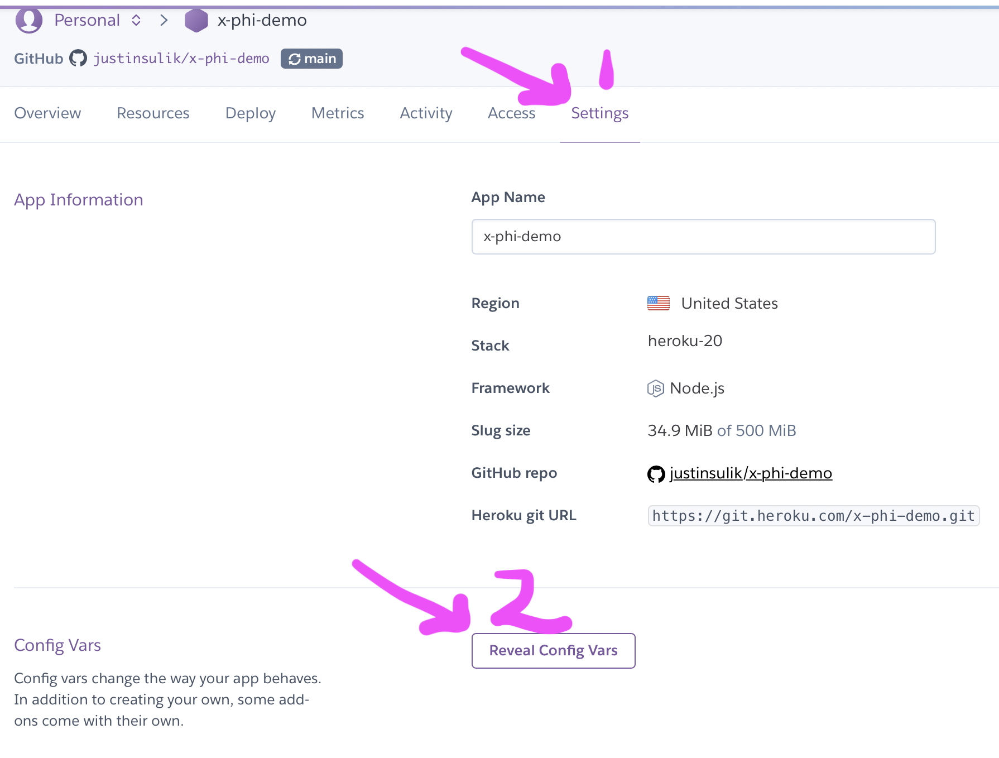
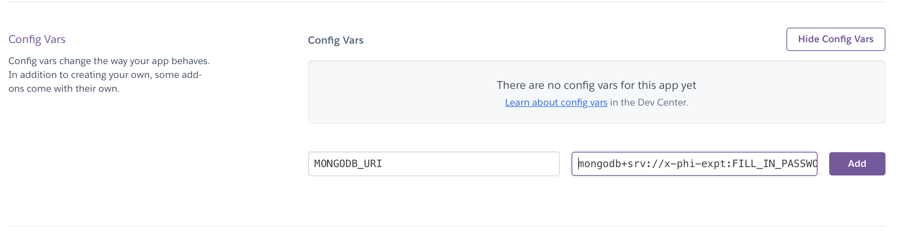
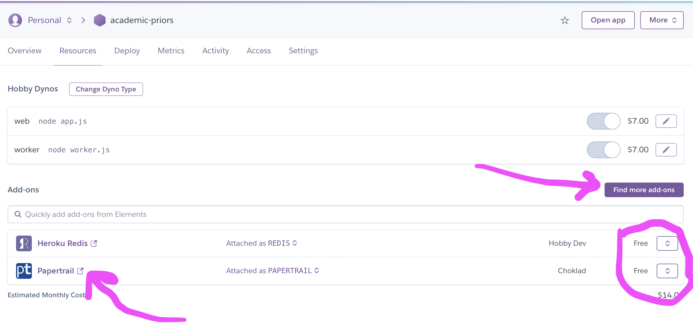
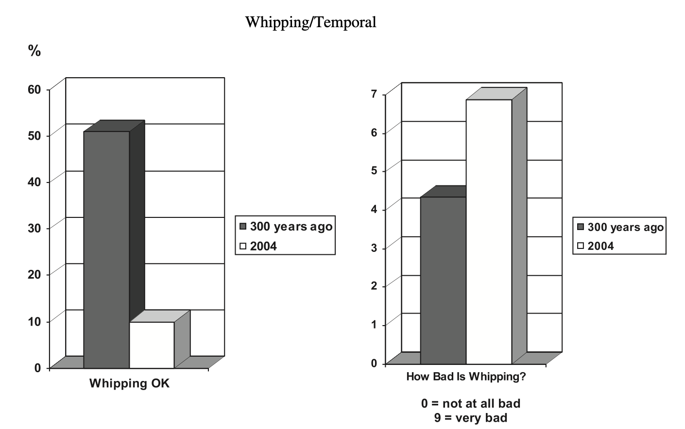

## Outline

- Practical: hosting your experiment online with Heroku

- Theoretical: Ethics

# Practical

## Previously:

- Where exactly are we meant to put our survey app?



## Hosting

- Plenty of options:
  - Dedicated machine in the department
  - Your own website
  - "Platform as a service", e.g. Heroku
  
## Heroku

 Key ingredients:
 
- Get your app ready as a git repo
- Tell Heroku you're setting up an app using that git repo
- Connect anything else you need:
  - Database
  - Logging
  - ...
- Deploy app
  
## (1a) Get an account

- You don't *need* to follow along, but it will be useful for you to do so

- [https://signup.heroku.com/login](https://signup.heroku.com/login)
- During signup it asks about language: choose node.js

## (1b) Download Heroku CLI (command line interface)

[https://devcenter.heroku.com/articles/heroku-cli](https://devcenter.heroku.com/articles/heroku-cli)

To log in:
```
heroku login
```

## (2) Build experiment 

- We've been covering this all semester
- One new thing: we just need a file called `Procfile` which tells Heroku *how* to run our app
  - Heroku will be looking for a tag `web` and we want to tell it this app is a node.js app, so:
  - The file just contains the line: `web: node app.js`
- Test the app thoroughly
- Commit the latest version

## (3) Initialize app

- I'm going to do this 2 ways:
   (1) through the webinterface (more visual)
   (2) through the command line (more convenient)

## (3a) Initialize app via web interface


## (3a) Initialize app via web interface

- Choose a unique name
- Choose deployment method: Heroku CLI or Github
  - Here, we're using github because the *other* method focuses on just the CLI
  - Follow the link to connect Heroku with Github (or [https://devcenter.heroku.com/articles/github-integration](https://devcenter.heroku.com/articles/github-integration))
  


  
## (3a) Initialize app via web interface

- Do you want to have Heroku re-deploy each time the github changes? Or manually?




## (3b) Initialize app via web interface

- In same directory as app+git repo

```
heroku create
```

- Make a note of the random name! (I just copy+paste it at the top of app.js)
- You can change it: [https://devcenter.heroku.com/articles/renaming-apps](https://devcenter.heroku.com/articles/renaming-apps)

## (3b) Initialize app via web interface

- This has created a git remote (on Heroku, not Github) for us to use 
- We can now upload directly to Heroku 
  - Recall the command: `git push <where> <which branch>`
  - So:  `git push heroku main`
- You can still manually set it to look at Github instead of its own internal git via the above steps

## (4) Addons: Database

- In week 9 we looked at how to create a database user and get a credentials string (and I mentioned that you should email me to set up time for us to do this together for your app...)
  - You can get the connection string from [cluster name] > connect > connect your application
  - You can get the password from Security > Database Access > [user name]
- We can just copy this credential string into Heroku under `config vars` 



## (4) Addons: Database

- MONGODB_URI is just the name we used on app.js line 34
- The value is what we got from MongoDB (don't forget to fill in password!)



## (4) Addons: Other



## (4) Addons

Speed?

- Part of the point of Heroku is that it's very flexible
- If you have a big fancy app, you can just allocate it more resources
  - Though this will start costing a little bit...

## Where is my app?


# Theory: Ethics

## Ethics

- Example questions: 
  - How do we make moral judgments?
  - What factors influence moral judgments?
  - What kind of thing is a moral judgment?

- Today: Look at the claim that emotions play a role

- We're going to delve into this *just enough* to discuss the experimental design

## Brief background

- Normative rules:
  - Shake with your right hand
  - Thank people when they've hosted a party
  - Don't marry your cousin
  - Don't murder people
  
- Some of these are more conventional, others seem to be moral
- What is special about *moral* norms?
- One suggestion: harm
- Another suggestion: emotions (negative affect)

## Nichols (2002): affect

- both moral and conventional norms are cultural
- so why do moral norms see somehow *stronger*? (more on this "moral signature response" later)
- one answer: they invoke negative affect
  
## Nichols (2002): evolution

- The evolution of norms
  - Not in the sense of "origins"
  - But in the sense of what survives (perseveres or is preserved)
  - e.g., for vertebrates, our backbones (despite our considerable variety)

## Nichols (2002): stability or cultural fitness

- Some norms highly changeable: 
  - We no longer have 16th century manners
- But others more stable:
  - People in the 16h century also thought murder was bad
  
- Refocus question: Why do some norms persevere?

## Nichols (2002): stability or cultural fitness

- In cultural evolution, various psych mechanisms make things more stable:
  - memory
  - salience
  - cultural attractors (see bloodletting example from week 9)
  
- Refocus question: What explains the relative stability of moral norms?
  
## Nichols (2002): sources of stability in ethics

- So what explains the relative stability of moral norms?
- Harm? turns out to be quite variable
- Emotions? Far more universal
  - NB: claim is not that everyone finds the same things disgusting;
  - Rather: that disgust is universal
- Strong negative affect can lend stability to moral norms
  - If a prohibited action invokes disgust, it will be more likely to survive
  - (ultimately contributing back to the moral/conventional distinction)
  
##  Nichols (2002): hypothesis

**Norms prohibiting "core-disgusting" actions (i.e., actions that are likely to elicit core disgust) will enjoy greater cultural fitness than norms prohibiting actions that are unlikely to elicit core disgust (or other emotions).**

##  Nichols (2002): data

- Historical etiquette books (1500s)
- Tried to find a section that includes both disgust and neutral norms:
  - manners about the nose/face/genitals?/clothes
  - yielded 57 items
  - tagged/rated/coded by naive rater
  - disgust/not + contemporary/not
  
## Nichols (2002): results

<image src="image/nichols.png" style="height: 500px">

## Discussion

- How convincing do you find this *sort* of approach, *broadly*?
- How convincing do you find this *specific* approach?
- *Assuming* that this has worked ok, have we learned something about ethics?
- What issues are there this design?

## Task

- (imagine you had access to any resources, including funds to pay participants or coders)
- How could we test this H better?
  - roughly: norms about disgusting actions will be more stable over time
  
- Things to consider (pick one!):
  - Source of data
  - Selection of items
  - Coding of items
  - Generalizability
  - Confounds
  - What related questions could be addressed

## Shifting focus

- Still, the idea that harm is a core part of moral norms (vs conventional ones) is really persistent, so let's tackle that more directly
- Also, let's set up the moral/conventional distinction a bit better (rooted in older psych work)

## Moral vs conventional

- Some norms have certain "moral signature response", e.g., in ratings
- Psych work since the 70s (Turiel, see cits. in Kelly et al.)

| Moral     | Conventional  |
|-----------|---------------|
| Objective | Arbitrary     |
| General   | Local         |
| Victim harmed     | No harm       |
| Violation serious | Not so serious | 

## Kelly et al. (2007): motivation

- Various pieces of evidence for these signature responses
  - With various cultures
  - With various ages
  - With various neurotypes
  
- But some other work (e.g., Nichols 2004): disgust has same features
  - Which suggests it isn't *just* harm
- But is a stronger claim possible? E.g., undermine the stability of the harm findings

## Kelly et al. (2007): aim

- Previous research relies on a wider group of non-harm actions, but a fairly narrow group of harm actions
  - They say: the kind of thing that school children get in trouble for
- If we widen the range of harm actions, will the results still be so consistent?
- Explicitly test generality by comparing very different time periods

## Kelly et al. (2007): Design

- Pairs of scenarios (e.g., similar action, different times)
- Each followed by 2 questions:
  - Is it ok? Yes/no
  - Rating from 0="not at all bad" to 9="Very bad"
  

## Kelly et al. (2007): Example item (1 of a pair)

Three hundred years ago, whipping was a common practice in most navies and on cargo ships. There were no laws against it, and almost everyone thought that whipping was an appropriate way to discipline sailors who disobeyed orders or were drunk on duty.

Mr. Williams was an officer on a cargo ship 300 years ago. One night, while at sea, he found a sailor drunk at a time when the sailor should have been on watch. After the sailor sobered up, Williams punished the sailor by giving him 5 lashes with a whip.

## Kelly et al. (2007): Example item (2 of a pair)

Mr. Adams is an officer on a large modern American cargo ship in 2004. One night, while at sea, he finds a sailor drunk at a time when the sailor should have been monitoring the radar screen. After the sailor sobers up, Adams punishes the sailor by giving him 5 lashes with a whip.

## Kelly et al. (2007): Other items

- harm: slavery (ancient world vs USA)
- authority: teacher and spanking (different states &rarr; different laws)
- negative affect: cannibalism (remote part of world vs California)

- Varying: harm; authority; affect

## Kelly et al. (2007): Results



&rarr; harm doesn't yield a firm moral/conventional distinction


## Kelly et al. (2007): Results

- Cannibalism
  - in remote part of world: 74% ok
  - in California: 56% ok

- Generally high levels (and cultural variation)

&rarr; Disgust doesn't yield a firm moral/conventional distinction

&rarr; Neither does harm

&rarr; This moral/conventional distinction based on cluster of responses is in trouble


## Discussion

- How convincing do you find this?
- Do you think there are any potential confounds or inconsistencies?
- Do you think the design imposes limitations to generality?
- Do you think the outcome variables are enough?

## Task

- Let's say we wanted to directly compare the centrality of harm and disgust to moral decision making
- Let's brainstorm some ideas


## Homework

Theory track:

- Read Young et al. (2010) for: 
  - Other method (fMRI)
  - Other factor (perspective taking)
- Reach Nichols (2002) OR Kelly et al. (2007)

Practical track:

- Follow the above instructions to get a toy experiment running online