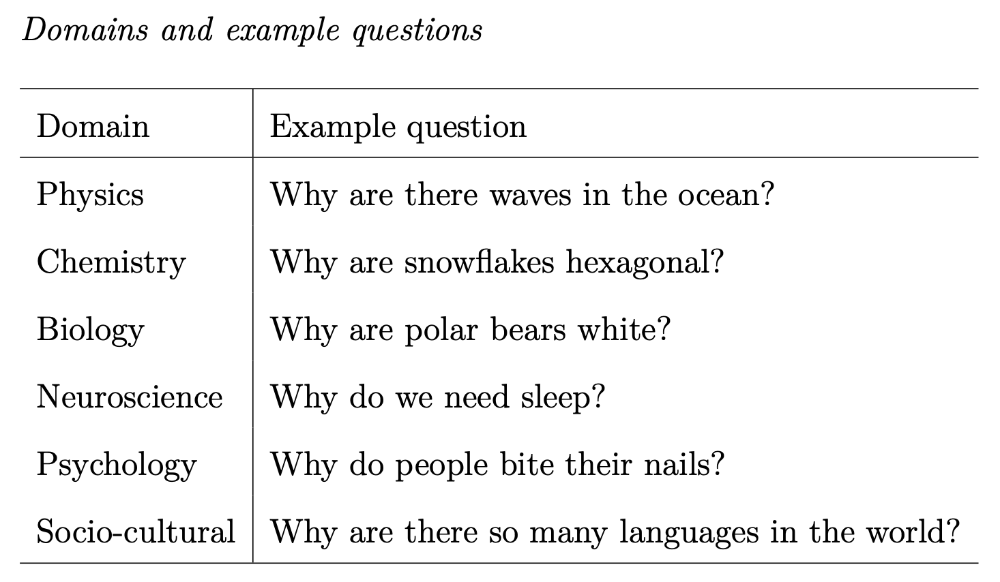
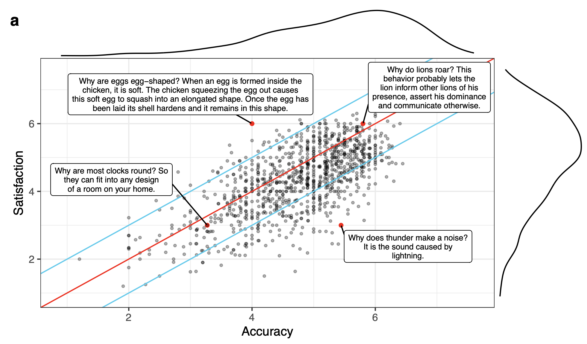
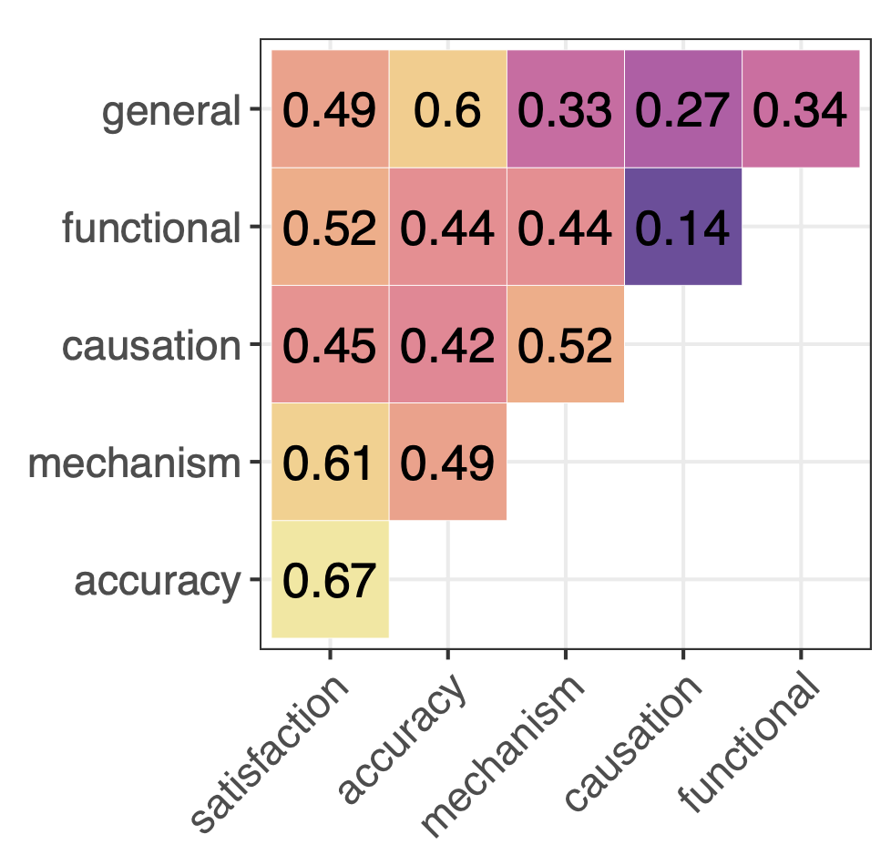
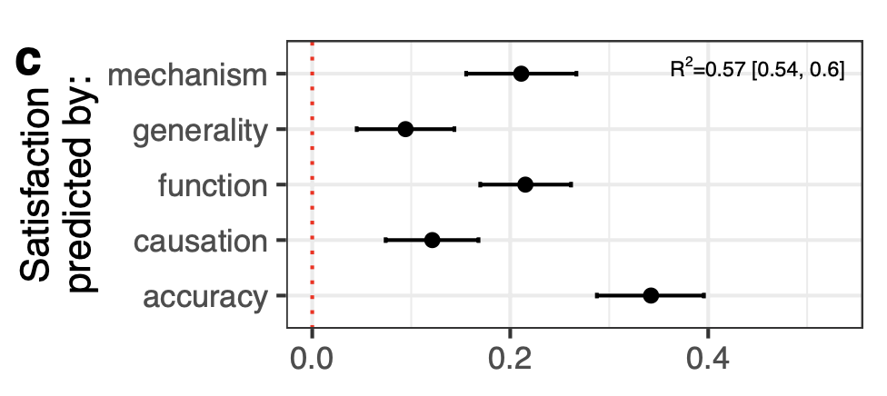
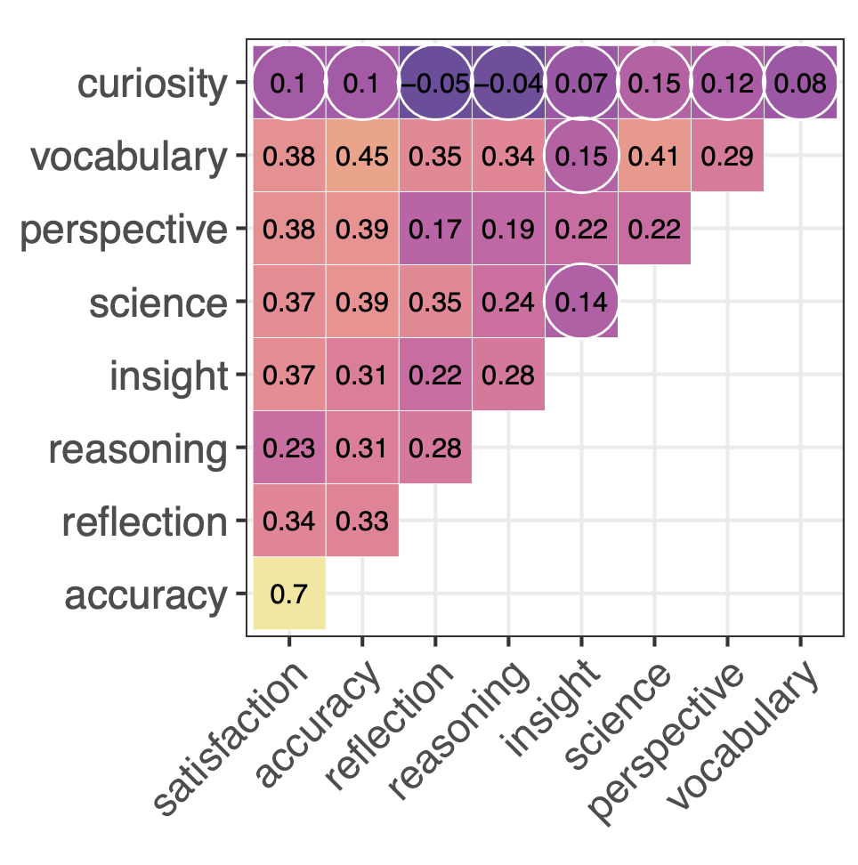
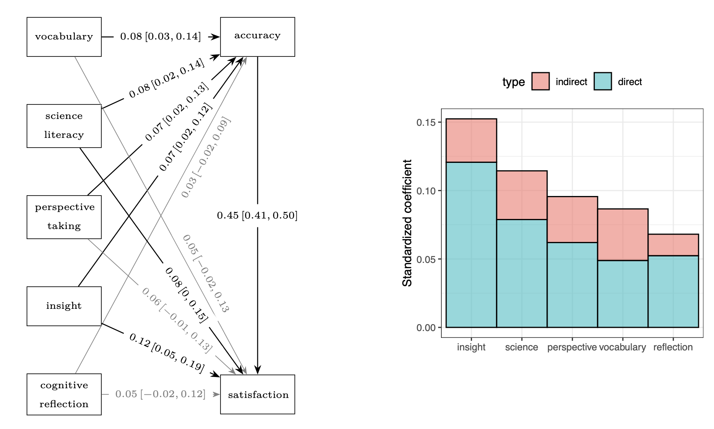

## Outline

- Theoretical: Science and explanation

- Practical: gamifying experiments

## Explanations

- What's the goal of science? Depends who you ask...
  - Prediction
  - Explanation
  - ...
  - (people can get quite ratty about this: [https://twitter.com/davidpapineau/status/1207225545743831041](https://twitter.com/davidpapineau/status/1207225545743831041))
  
- Assumptions for the sake of this class:

&rarr; part of doing science involves explaining things

&rarr; there is a continuum between scientific and non-scientific explanations

## Questions

- What is an explanation?
  - What kind of thing is it?
  - What features must it have?
- What is a good explanation?

- As previously we're going to get *just* enough detail on the theory to start talking about design
- For a fuller story see [https://plato.stanford.edu/entries/scientific-explanation/](https://plato.stanford.edu/entries/scientific-explanation/)

## What is an explanation?

- Heaps philosophy of science on this

- Not just truth, so what is the essential component?
  - Deductive-Nomological 
  - Statistical Relevance 
  - Causal Mechanical 
  - Unificationist 
  - Pragmatic

- Obvs these run into several issues (what is a law? what is causation? etc.)
- And even so ...

## Colombo (2017)

- Much ink spilled over the question of what an explanation is
- But what if there is no single account that always works?
- Philosophy of explanation doesn't seriously accept that psych evidence might constrain theorizing
  - But what if psychological evidence can support pluralism?
  - I.e., philosophers can't agree on a formal account of explanation because there are many concepts of explanation in human psychology

    &rarr; look for psych evidence that people spontaneously appeal to different kinds of criteria

## Caveat

- Philosophical "Ought" or "Optimal" vs psychological "Is"
  
## Williams & Lombrozo (2010)

- Explain vs describe vs think aloud

<image src="image/williams.png" style="height:400px">

[//]: # (participants that explained were more likely to seek more unifying, subsuming regularities, which supports the idea that explanation sometimes prompts one to relate what is being explained to encompassing argumentative- patterns or general principles or theories, rather than to causal mechanisms [colombo 2017 p 508])

## Walker, Lombrozo, Legare & Gopkin (2014)

- Explain vs report

<image src="image/walker1.png" style="height:400px">

## Walker, Lombrozo, Legare & Gopkin (2014)

<image src="image/walker2.png" style="height:400px">

## Back to the pluralism idea

"while explanation sometimes engages deductive reasoning and theory-like representations in human psychology, explanation often recruits inductive reasoning and information about causal mechanisms, too" (Colombo, 2017, p 508)

- Why does pluralism make sense in any case?

- Humans have a lot of things we need to do to learn about the world: generalize, discover, test/confirm hypotheses...
- Explanation has a variety of cognitive functions: constrains generalization, facilitates discovery, plays a central role in confirmation

## Explanations in the wild

- Much work on explanations has been with artificial phenomena or researcher-generated explanations
- But explanations play a vital part in people's daily lives
- What can we learn about generalizations by
  - Having people generate free-form responses to a range of "Why" questions?
  - Have other people rate them?

- Sulik, van Paridon & Lupyan [https://psyarxiv.com/djaex/](https://psyarxiv.com/djaex/)

  
## Explanations in the wild: Study 1

- 50 "Why?" questions

## Explanations in the wild: Study 1

- 224 participants provide free-form responses to 4 or 5 questions ($\sim$ 1000 explanations)
- 3118 participants rate each (10 raters/explanation) for:
  - satisfaction
  - accuracy
  - causation
  - mechanism
  - generality
  - function
  
## Examples

- Function: Why do we dream?
  - Low: We dream when we are in a sleep stage during rapid eye movement and it is part of everyday normal life
  - High: We dream to consolidate/solidify memories, emotions, etc.

- Mechanism: Why does thunder make a noise?
  - Low: Because of sound waves.
  - High: I believe thunder is caused by lightning affecting the air around it. The air expands quickly, either quick enough for a crack or a rumbling sound, because the lightning increases air pressure and temperature causing the sound of thunder.
  
## Examples: interesting failures

- Why does Saturn have rings? 

- "Particles are attracted to Saturn's strong gravitational pull and are prevented from escaping."

- If that's the explanation, then why doesn't Jupiter have rings?
  
## Overview

## Overview

## Predictors of satisfaction

## Study 2

- What is an explanation? Try to answer by looking at what cognitive traits predict ability to provide a good one

- If explanation is about having right facts: knowledge 
- If explanation is about *using* facts smartly: reasoning or intelligence
- If explanation is about *searching* for or *using* right facts: curiosity or reflective style
- If explanation is about finding *relevant* facts: insight
- If explanation is about *communicating* facts to audience: perspective taking

## Study 2

## Study 2

## So what has this got to do with philosophy?

- Well, nothing. This is psychology. 

- But recall Colombo's point that psychology of explanation can inform philosophy of explanation
- Surely this doesn't mean *only* psych evidence about things that philosophy of explanation cares about
  
    &rarr; a bottom-up approach

- And in any case there likely to be a continuum between scientific explanation and explanation in the wild

## Task

- One important example in the philosophy of explanation is this:
  - There is a relationship between the height of a flag pole and the length of its shadow
  - And yet, we're happy to say "the height of the pole explains the length of the shadow" but not the reverse
  - The phil literature focuses on why this difference *ought* to follow from what an explanation is
- But let's shift the focus to the psychological *is*
- How would you try get at *why* lay-people think that one direction is an explanation and the other is not

# Practical: Gamifying experiments

## Gamifying experiments

- We've mentioned engagement, motivation and attention as important factors (often overlooked in x-phi experiments)
- 2 weeks ago we talked about using animations to boost the above, but we can take it a step further:
- Turn the experiment into a game!

## Example

- The causal illusion bias: over-interpreting an accidental relationship or random noise as a causal relationship

&rarr; example script has a range from more survey-like to more game-like

## Games

- Cf. Wittgenstein: no set of essential criteria
- There's a whole field on the philosophy of games:
  - [https://onlyagame.typepad.com/only_a_game/2006/04/the_complexity_.html](https://onlyagame.typepad.com/only_a_game/2006/04/the_complexity_.html)
  - [https://en.wikipedia.org/wiki/Man,_Play_and_Games](https://en.wikipedia.org/wiki/Man,_Play_and_Games)
- Rather, think of clusters of ingredients for a gamified experiment:
  - Experience: fun, motivation, reward, incentive
  - Task: problems, choices, decisions, uncertainty, risk, feedback
  - Outcome: personal vs research discovery, challenge, victory, narrative

## Games

- A few things that help a game be successful as a research tool:
  - Intrinsic motivation
  - Clear goal, easy to explain mechanisms
    - Can mechanisms be learned on the fly rather than via text instructions?
  - Balance risk and reward
  - Balance structure and freedom
  - Yield both simple measurements as well as richer data

## Tasks

- We won't get through all of these, so it's up to you where you start: 
- Use these criteria (or invent your own!) to argue why these tasks are or are not game-like
  - Pick one of the *less* game-like tasks from the demo study. How could it be gamified?
- Pick a research question and design from the course (or your own interests). Workshop a few core components:
  - Research goal vs participant's in-game goal
  - Narrative/framing
  - Illustration of a basic choice in the game
- Pick a game you know and enjoy. Does it offer (or can it be tweaked to offer) any philosophical content?
    
## Homework

- Next week, we'll to a review and look at the assignments + how to succeed

- So ahead of that:
  - Revise the slides/your notes
  - Think of at least one question to bring up
  - Have a think about your assignment choices