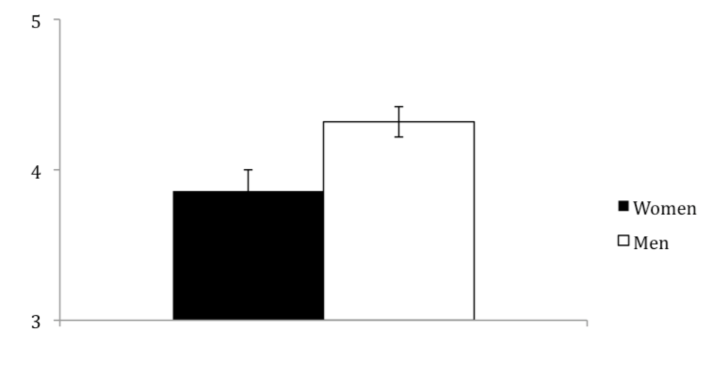
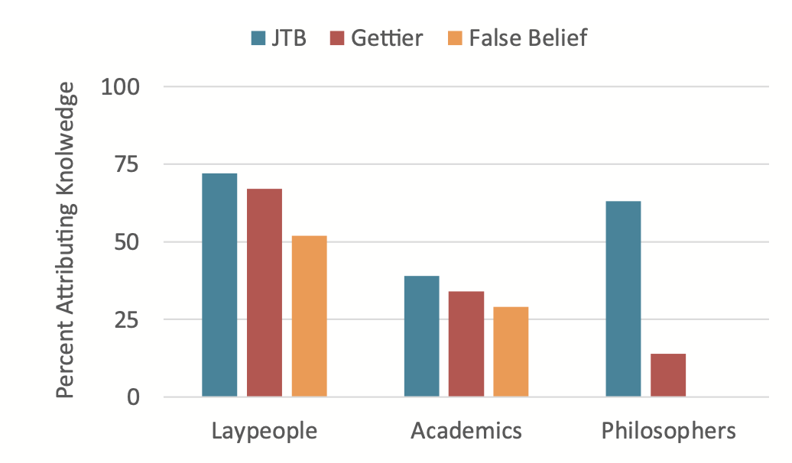
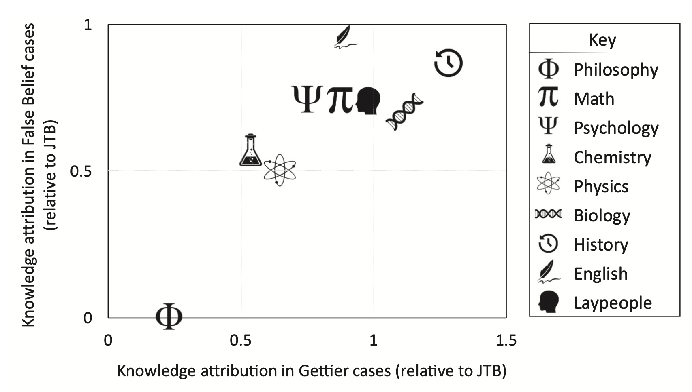

## The plan

- Finish the HTML/CSS/JS exercises from last time
- This week's X-Phi topic: Whose intuitions? Diversity in researchers and research subjects
  - Reminder why we care
  - Concrete examples: gender, culture, training
  - What to think about all this?
- This week's practical topic: Intro to jsPsych

## Recap

- Much of philosophy relies on intuitions as evidence (method of cases, Gettier cases, intuition pumps, etc.) 
- theory &harr; intuition
- "Experimental philosophy interrogates the role of claims taken to be obvious within philosophy and specifically within philosophical thought experiments" (Pohlhaus, 2015)

## Recap

- Weinberg et al. (2001) call this 'intuition-driven romanticism'
  - (recall the negative/positive projects? This is pretty negative...)
  - 'romanticism': the power is within you, you just need to let it emerge
  - 'intuition-driven romanticism': knowledge of correct philosophical norms is somehow implanted in us; we need to let it emerge by reflecting
  
## Recap

- Last time, we just talked about intuitions differing
   - Awkward if intuitions are meant to be obvious/right/evidence
   - Motivation for X-Phi
- 'So, for example, in a Gettier case where a philosopher would say "it is obvious that we would not call this knowledge" or "normally we would not call such a case knowledge," the experimental philosopher says "but how do you know that's not what people would normally call knowledge?" and then conducts surveys to test what people find obvious or "normally" say about the example.' (Pohlhaus, 2015)
  
## Heads up

- This week:
  - Whose intuitions to consult?
  - Who is the "we" in "we just need to reflect on our intuitions?"
  - Anyone?
  - Anyone "philosophical enough"?
  - Who gets to decide who is "philosophical enough"?
  - Is it a problem if the people who are "philosophical enough" are predominantly white western males?

## Heads up

- This is going to take us beyond philosophy
- It's also going to involve talking about diversity and why it matters for doing philosophy well

# Concrete examples

## Gender

(See citations in Buckwalter & Stich, 2014)

Suppose Scientists figure out the exact state of the universe during the Big Bang, and figure out all the laws of physics as well. They put this information into a computer, and the computer perfectly predicts everything that has ever happened. In other words, they prove that everything that happens, has to happen exactly that way because of the laws of physics and everything that's come before. In this case, is a person free to choose whether or not to murder someone?

- 63% of women said yes
- 35% of men said yes

## Gender

Jill wakes up one morning and finds a strange man next to her in bed, plugged into her kidney. A man from the Society for Music Lovers introduces himself and explains to Jill that she has been plugged into a famous violinist who is dying of kidney failure. Without Jill's help, the violinist will die. The man from the Society explains that Jill must stay plugged into the violinist for 9 months in order for him to recover and survive. Jill pulls the plug and the violinist dies.

- Jill's pulling the plug was: 1=Forbidden to 7=Obligatory

(Watch out for nerdview!)



## Culture (including SES)

(Weinberg et al., 2001)

One day Charles is suddenly knocked out by a falling rock, and his brain becomes re-wired so that he is always absolutely right whenever he estimates the temperature where he is. Charles is completely unaware that his brain has been altered in this way. A few weeks later, this brain re-wiring leads him to believe that it is 71 degrees in his room. Apart from his estimation, he has no other reasons to think that it is 71 degrees. In fact, it is at that time 71 degrees in his room. Does Charles really know that it was 71 degrees in the room, or does he only believe it? 

Really knows (grey) Only believes (white)

(beware of bare figures!)


## Training

Starmans & Friedman (2020) probed Justified True Beliefs (JTB), Gettier cases, and false beliefs



# So? What does this all mean?

## 1. What does it mean for philosophy (as a subject)?

- E.g., in terms of:
  - Negative project: we shouldn't rely on intuitions?
  - Positive project: canvassing more diverse intuitions will help us build better theories?
- For these, it will depend how reliable results are
  - wait until week 7 (replication)
- And on specific topics/findings
  - weeks 10-13 (specific topics like mind, language, science, ethics)

## 1. What does it mean for philosophy (as a subject)?

- For now, let's be cautious: it's not clear how systematic/pervasive this variation is or why it's happening
- BUT also clear: if much of the literature is just American white male philosophers surveying their (mostly white, middle class) undergrads, then we may be getting a very specific subset of intuitions rather than more naturalistic variation

## 2. What does it mean for philosophy (as an institution)?

- Definite gender imbalances in philosophy (Buckwalter & Stich, 2014; Figdor & Drabek, 2016)
- If intuitions vary by gender, then are we really just getting male intuitions rather than "philosophical" intuitions?
- If intuitions vary by culture, then are we just getting Anglo-Saxon intuitions rather than "philosophical" intuitions?

"If there is significant cultural diversity in folk intuitions, this might undermine the authority of a priori philosophical methods because philosophers will often be blind to the culturally local aspects of their concepts." (Nichols, 2004)

## 2. What does it mean for philosophy as an institution?

- Note: the claim is not that there's anything wrong with finding out the intuitions of white western men
- Rather, it's that it's hard to separate out the effects of gender, culture, training, etc. in explaining these intuitions
- The classical claim is that the intuitions seem obvious/feeling of rightness
- It's hard to know whether the feeling of rightness is because it's philosophically valuable, or because just cultural bias

## 2. What does it mean for philosophy as an institution?

- Selection effect: play nicely, get invited to the game (Buckwalter & Stich, 2014)
- Either way, we need more diversity in philosophy (Pohlaus, 2015; Figdor & Drabek, 2016)
- But still need something more...

## 3. What does it mean, beyond philosophy?

- Very little useful talk about "Why?"
  - If we're aiming for greater explanatory depth, can we do that within x-phi? Within philosophy? 
- Maybe these are just opinions. What about a more basic/universal/objective concept (e.g., causation)? 
- What is the role of  "obviousness" in this discussion?

## Culture and causation

Here, we're taking a step back, looking at some cultural psych. 

Why?

- How deep could the kind of training above go: as deep as causation (cf. Hume)
- Interesting to compare with another debate: cognitive universals vs cultural variability
- Exampled quoted above have a fairly impoverished discussion of "Why?"
  - (e.g., Weinberg et al. refer in a vague hand-wavy way to "collectivist" vs "individualist" cultures. How does that work?)

## Culture and causation

Bender & Beller (2019)
- Causation is a fairly foundational philosophical topic (cf. Hume)
- Seems universal
  - Animals and children have rudimentary understanding 
  - (this is often trotted out as an argument for universality in psych. How does it strike philosophers?)
- In that case, would expect judgments about causation to be fairly consistent across cultures
- Well, yes and no
- Why is the "no" part interesting, regarding our current dilemma?

## Culture and causation

- Some animals do seem to understand causation
- BUT humans (even children) are *much* more able to: 
  - generalise/abstract
  - integrate wider range of information 
  - share wider range of information

- This is powerful: we can build theories rather than grasp individual events

## Culture and causation

- This is  also cognitive AND rooted in sociality, teaching, and other human capacities such as language
  - (hence, cultural psych)

"Sociality, teaching, and the language faculty are among the key enablers of human culture, giving rise not only to uniquely human characteristics but also to an amazing diversity in these characteristics." (Bender & Beller, 2019)

## Culture and causation: language

- Language
   - Languages vary in how they structure utterances (what is obligatorily expressed and how)
   - Compare English "He forgot" vs. "He must have forgotten"
   - Imagine doing this *explicitly* for every verb
   - ([https://en.wikipedia.org/wiki/Evidentiality](https://en.wikipedia.org/wiki/Evidentiality))
   
## Culture and causation: language

- This includes causation
- Languages vary wildly in how/whether the agent is marked
- English: not so much
    - "He moved the ball" vs. "The ball moved" vs. "He moved" (no distinction in verb!)
- Other languages make distinctions/group these differently
    
## Culture and causation: language

Fausey & colleagues (reported in Bender & Beller, 2019)

- Speakers of 3 languages
- Shown intentional/accidental events
- All speakers aligned for intentional events (provided agentive descriptions)
- But speakers of languages with preference for nonagentive phrasing were less likely to do so for accidental events
- And less likely to remember the agents of accidental events

## Culture and causation: language

- NOT saying this means language causes people to think differently
- AM saying this means people vary in what they habitually attend to/remember/infer
- AM saying this means the language/phrasing of vignettes is seldom objective/neutral
- AM saying that culture is one thing that can influence interpretation of *apparently* neutral sentences

## Culture and causation: teaching

- We may like to think of things like causation/mechanism as objective
  - Everyone would discover the same truth, ultimately
- But how much of this do you think you learned independently vs. from others?
- Teaching scaffolds a *lot* of what we believe about how things work

## Culture and causation: teaching

- A lot of things taken for granted in Western societies are actually weird
  - Western Educated Industrial Rich Democratic (Henrich et al., 2010)
  - (for a cool new application, see Muthukrishna et al. 2020)
- This includes teaching
  - How much time children spend with adults vs. with peers
  - What kinds of questions/how often children typically ask
  - Attention to causation/mechanism/outcomes/covariation

## Culture and causation: teaching

(See citations in Bender & Beller)

- In many cultures (e.g., Samoa): 
 - Little explicit teaching
 - Fewer explanation-seeking questions from children
 - Less discussion of intentions
 - More attention to outcomes than causes

## Culture and causation: material/social environment

- A lot of the x-phi work appeals to vague notions such as collectivist vs individualist cultures (e.g., Weinberg et al. 2001)
- But leaves lots of unanswered questions:
  - why do those cultural types have those effects? 
  - why do those cultural types exist?

## Culture and causation: material/social environment

- Possibile explanations are rooted in material environement
- (Talhelm & colleagues)
- Rice vs. wheat growing in different parts of China
- Studied neighboring cultures with different subsistence methods
- Networks of interdependence/duty/obligation/agency


## Culture and causation

- This is not about causation, but is an illustration of culture affecting what strikes you as given
- Müller-Lyer illusion and "carpentered" culture
- [https://en.wikipedia.org/wiki/Müller-Lyer_illusion](https://en.wikipedia.org/wiki/Müller-Lyer_illusion)


## Gender and obviousness

Pohlhaus (2015)

- "Experimental philosophy interrogates the role of claims taken to be **obvious** within philosophy and specifically within philosophical thought experiments."
- Different values/experiences make different things obvious
- If different people have different intuitions, need to ask: what are the values (individual/social/institutional) that lead to these intuitions?
- Aim is not to throw out intuitions, but to make these obvious to all
 
## Gender and obviousness

Pohlhaus's feminist critique of X-Phi:

 - don't just find out what strikes different people as obvious
 - try to find out/understand why different things seem obvious to different people
 - otherwise "a lot of people like you don't judge Gettier examples the way a philosopher would" just seems like stopping the conversation, rather than moving it forward

"That different groups of people might habitually draw on particular background assumptions to make sense of the world (which when taken seriously by people who habitually draw on different background assumptions, would help this second group to attend to different aspects of the world than they normally do)"

## Final questions

- Asking "why?" strikes me as important, when it comes to the existence of differing intuitions
- Getting at "why?" satisfactorily can involve moving beyond x-phi
  - Within philosophy: feminist philosophy
  - Outside of philosophy: cultural psych/social psych/anthropology/etc. (i.e. move into cognitive science)
  
## Final questions

- Also involves poking at the methods a bit more
 - What if men just likely to give answers further away from the mean?
 - What if people who care less tend to pick answers on the right of the screen?
 - What if lay people can't be bothered with "believe" vs "know"
 - What if language of vignette isn't as clear/unambiguous as the experimenter thinks?
 - What if there are sampling issues?

## Final questions

- Do these intuitions *really* differ? See week 7

# Practical side: jsPsych

## Recap

- Don't think of this like learning French
- Think of it more like learning French cooking
- Want to just get good at a few recipes; don't need to understand it to the same level as a Michelin-starred chef
- Even more: like learning French cooking when you buy sauce in a jar rather than creating from scratch

## Heads up

- jsPsych is the "sauce in a jar":
  - An open-source javascript library/package
  - We learned about writing functions
  - Some nice people (De Leeuw and colleagues) wrote a *lot* of functions to handle online experiments for you
  - Bundled them up
  - You can just download them and use them in your recipe without having to do much actual coding

## Heads up

- Sure, there are things you may want to tweak:
  - This sauce isn't spicy enough
  - This sauce is too thin
- But then you try problem solve (with google) those specific things rather than learning a list of all possible tweaks
 - google: 'thicken sauce'
 - google: 'randomization in jsPsych'

## Heads up

- This may feel weird
- You may often have the feeling "but I don't know how this works"
- Up to you: just follow the recipe, or go poking at the list of ingredients on the sauce jar...
- The only 2 concepts you *have* to get are 'arrays' and 'objects' so let's start with those
  
## Arrays

Plain variables:

`var a = 1`

Arrays:

`var b = [2, 4, 6]`

This is just an ordered list with [ ] around it

`var morning_routine = ['get up', 'coffee', 'newspaper', 'shower']`

`var places_lived = ['South Africa', 'Taiwan', 'Scotland', 'USA', 'Netherlands', 'England', 'Germany']`

## Arrays

See example 1 for a few things you can do with arrays

Why is this relevant?

You can think of an experiment or survey as an ordered list of tasks

## Objects

An object is just a collection of named properties (`{}` instead of `[]`)

`var justin = {name: 'justin sulik', height: 189, cats: 2}`

For ease of reading, we often spread this out:

```
var justin = {
 name: 'justin sulik',
 height: 189,
 cats: 2
}
```

## Objects

See example 2 for a few things you can do with objects

Why is this relevant?
 
You can think of each task in a study as an object

```
var main_instructions = {
 type: 'instructions',
 content: 'Here are some instructions',
}

var questionnaire_1 = {
 type: 'multiple-choice',
 questions: ['I like coffee', 'I like tea'],
 options: ['Disagree', 'Neutral', 'Agree']
}
```

How do you know what properties each object has/needs? Google and copy+paste

## A basic jsPsych experiment

Need some tasks: various objects (`var main_instructions = {}`, `var questionnaire_1 = {}`)

Need a timeline: an array (`var timeline = []`)

Put the objects in the array (`timeline.push(main_instructions)`)

Tell jsPsych to start an experiment with that timeline

## A basic jsPsych experiment

Open exercise 3

## Homework

- Readings:
  - Forget the Figdor & Drabek reading. If you're interested in this, read Pohlhaus (2015) instead
- Practical:
  - Create a new html file (just copy+paste exercise 3, give it an informative name)
  - Look up one more jsPsych trial type, read the documentation, look at the example
  - Try include it in a toy survey

