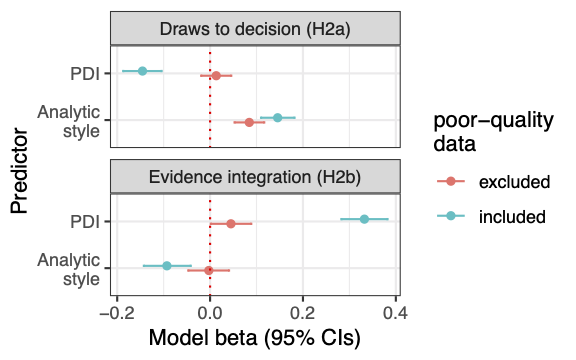
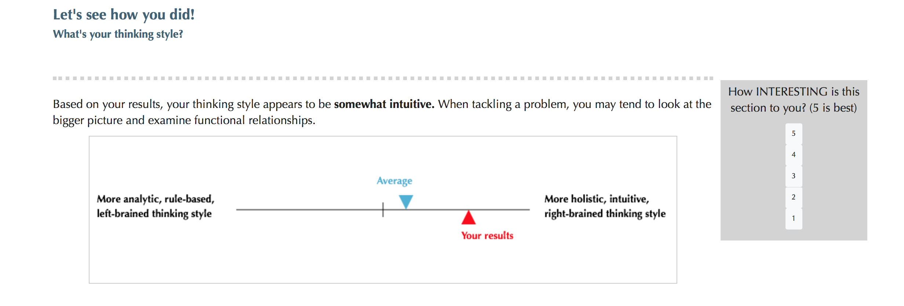
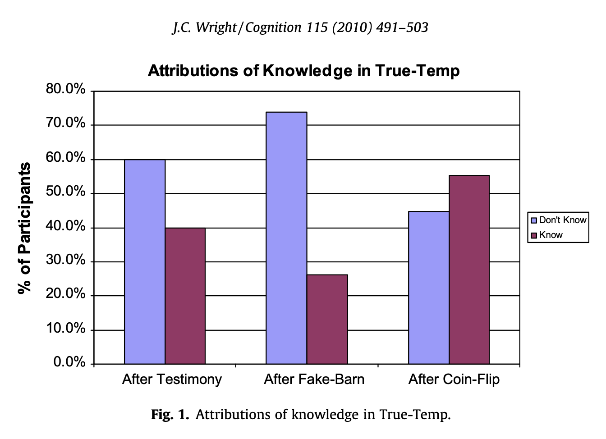
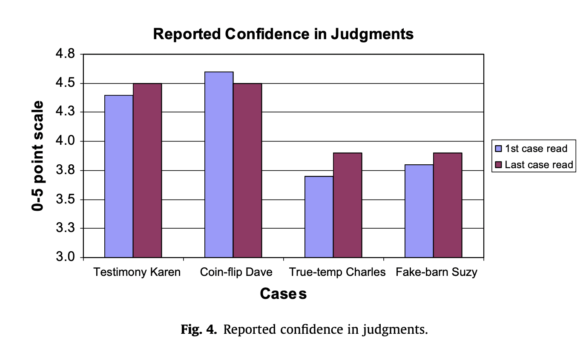
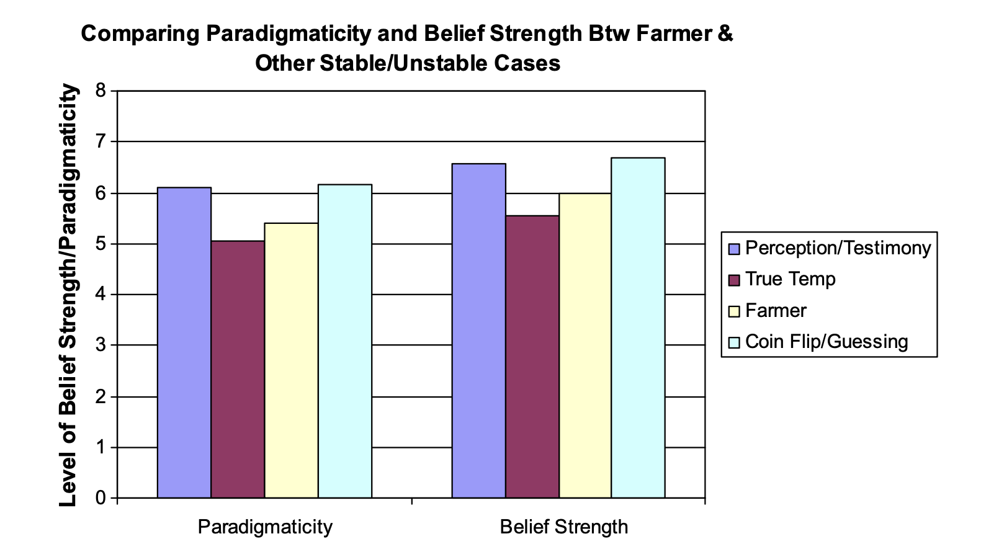

## Where we are now

- We've built a little survey in jsPsych (or at least, if you didn't manage it, you haven't told me there were problems...)
- Today:
  - Practical - What about data quality online?
  - Theory - What are intuitions anyway?
  
## Online data collection

- You host your study online
- Post a link to some recruitment platform (MTurk/Prolific/Crowdflower/...)
- Participants click the link, do the study, get a completion code
- Enter the completion code on the recruitment platform to get paid

- Brainstorm some differences between collecting data in the laboratory and doing it online

## Online data collection

- You don't know who they are
- You can't see what *else* they're doing
- You can't see if they're working carefully
- You can't see if they are who they say they are

&rarr; You need to be *very* careful about data quality

## Issue 1: Who are they? Demographics

- On MTurk, predominantly USA/India
- On Prolific, more UK/Europe

- Compared to the general population they are:
  - Younger
  - More educated
  - More liberal
  - Underemployed
  - Less religious
  - (Mason & Suri, 2011)

- But they are still more diverse than traditional university samples (Buhrmeister et al. 2011)

## Issue 1: Who are they? Personality

- Less extroverted
- Lower self-esteem
- Higher social detachment
- More social anxiety

(Goodman et al., 2012; McCredie & Morey, 2018)

## Issue 1: Who are they? Sample size

- In theory, many thousands
- But a few thousand do *most* of the work
- Non-naivete is a problem...

## Issue 1: Who are they? Motivation

- Only 12% have MTurk as a main source of income
- 12% say money is irrelevant
- 69% "MTurk is a fruitful way to spend free time and get some cash"
- 41% say **fun** is a major reason for participating

&rarr; Don't give them page-long instructions

&rarr; Avoid making it repetitive

&rarr; Bear in mind, you're competing for their attention with *everything else on the internet*

## Issue 2: You can't see what *else* they're doing

- Most at home (86%) and alone (73%)
- Many engaged in other activities: 
  - TV ~20%
  - music ~15%
  - chatting online  ~5%
(Chandler et al., 2014)

- jsPsych can track if they leave/defocus the window + how long
- And inattention/careless responding isn't actually any lower than in the lab

&rarr; Within reason, be explicit in your requirements

&rarr; E.g. "Please don't google the answers to this quiz. We genuinely want to know what you think."

## Issue 3: You can't see if they're working carefully

- It's common to use attention checks
 - A question where they should give a particular answer if they're paying attention
- Simple: 
  - While watching television, have you ever had a fatal heart attack?
  - I have never used the internet
  - If you are reading this, click "strongly" disagree
 
## Issue 3: You can't see if they're working carefully

- However, people get very familiar with these
- Brainstorm: how else might you check/encourage attention?

## Issue 3: You can't see if they're working carefully

- In 2018 there was a "bot panic"
- Turns out it was mostly just "survey farms" in various low income countries
- They used VPNs to appear as though they were in the USA

- Best solution: Turkprime
  - Tracks worker quality, filters out suspicious locations
  - Much better quality
  - Can link MTurk account to Turkprime account

&rarr; Think of tasks that are easy for anyone who is halfway capable and paying even a small amount of attention

## Issue 3: You can't see if they're working carefully

- My preferred option: a simple English test
- (example_1.html)

## Issue 4: You can't see if they are who they say they are

- Let's say you want to do a study on footballers
- Do you say "Only do this task if you're a footballer"?
- Do you just ask "Are you a footballer?"

&rarr; Be explicit about what they should do

&rarr; But avoid revealing what it is you're looking for

&rarr; Remove any incentives for lying

## Issue 4: You can't see if they are who they say they are

- Turkprime can help with re-recruitment
- Do a study where you ask a bunch of questions (e.g. hobbies)
- Get the MTurk IDs of those who meet your requirements
- Create a second study, and copy+paste the relevant IDs collected during the first study ("Worker requirements")

## Other points for getting good data:

- Make it impossible for them to mess up
- Ask comprehension questions IF it's complicated
  - you can use JavaScript to prevent a task proceeding until they've passed the test
- Keep things simple
- Game-ify if possible

## Other points for getting good data:

- Show, don't tell
  - Tell: "In this task, we will drop white and black beads into two urns. One urn will have 60% white beads and 40% black beads, the other urn will have 40% white beads and 60% black beads. We will select one of these urns (you won’t know which) and will then start drawing beads from the urn and showing you the color. We will then replace the bead back in the urn. It’s up to you how many beads we draw - when you’ve seen enough beads that you’re confident about the majority color in the urn, indicate that you are ready to make a decision."
  - Show: [https://cryptic-headland-48158.herokuapp.com](https://cryptic-headland-48158.herokuapp.com)

## Other points for getting good data:

- This isn't a stats class, so I won't go into details, but there are plenty of signatures of poor responding in the data

- Dupuis et al. (2018) or Buchanan & Scofield (2018)

- But brainstorm: what would careless data look like? 
  - E.g. on a long survey
  - On an open-text response
  
## This matters!

- [https://psyarxiv.com/ntsve/](https://psyarxiv.com/ntsve/)
- We replicated several classic findings in clinical psych concerning cognitive biases and delusions
- But many of these vanished when we excluded inattentive workers!

</img>

## Other points:

- Pay well!
- Communicate
  - Let them contact you
  - Let them leave feedback (open-text at end, optional)
  - Give them feedback! (e.g., how well they did compared to others/how typical their opinions are/Sorting Hat)
</img>

# Theory: What are intuitions anyway?

## Recap

- Previously: 
  - Philosophers rely on intuition
  - X-Phi shows intuitions can be highly variable
- Last time:
  - Instead of theory &harr; intuition
  - It's more like theory &harr; (data &rarr; *inferred* intuition)
  - Focusing on how methods/design/psych issues affect what *data* you get
- This time:
  - What are the intuitions anyway?
  
## Two views of intuition

- de Cruz (2015)
- Intuitions: judgments that come about without explicit reasoning/somehow seem right
- Consider speaking your native language vs. reading

&rarr; How are these similar/different

## Psychology of intuition: basic processes

- "core cognition": intuitive psych, intuitive physics, intuitive biology
  - How babies at just a few months expect things to persist, not fall apart without external cause
  - How young children understand that others have motivations, that animals behave in certain ways

- Laid on top of this: "folk theories" (so "folk psych, folk biology etc.")
  - More culturally variable
  - More complex
  - Still intuitive (non-reflective, no inferences, effortless, "that's just the way it is")

## Psychology of intuition

- Dual systems/dual process theories

- Type 1: intuitive
- Type 2: effortful

- "A bat and a ball cost \$1.10. The bat costs \$1 more than the ball. How much does the ball cost?"

## Psychology of intuition

- Two kinds of Type 1 process:
  - Maturational: arises through mundane reactions, species typical, low variability in proficiency (e.g.,  speaking a language)
  - Practiced: doesn't arise spontaneously, needs scaffolding/training/practice, higher variability in proficiency (e.g., reading, playing an instrument: some more expert than others)
  
- Philosophical intuitions are both

&rarr; Need to be aware if homogeneity is due to all having similar philosophy training, for instance. Or due to human universal patterns of cognition. Similar for heterogeneity. 

## Are intuitions stable?

- Shtulman & Harrington (2016)
- Does the earth go around the sun, or the sun around the earth? Which is more intuitive?
- Obviously, learning about science teaches you the right (if counterintuitive) facts
- BUT under time pressure, even scientists find it hard to reject intuitions!
- The intuitions seem to be there, underlying later knowledge; they're just suppressed sometimes
- (Sometimes re-reveal themselves in old age)

&rarr; Need to be aware of current state of participant (e.g., time pressure)

## Are intuitions as unstable as X-Phi experiments suggest?

- Recall last time: we talked about ordering effects
- Wright (2010) pursues these further... 

- One core concern: we have no way of calibrating our intuitions
  - e.g. knowing when it happens/which items are susceptible to it
  - if we can provide evidence of calibration, then intuitions can still be epistemically valuable?

&rarr; need reliable method to track stability (or its absence)

## Calibration

- Let's refresh our memories: the vignettes at the end of Wright & her replication of previous findings...

- Why are *those* particular items susceptible to order effects?

## Calibration 1: confidence

- Study 1: Had participants rate how confident they were

## Calibration 2: paradigmaticity

- Study 2: Had participants rate what % of people would agree (how typical/paradigmatic) and belief strength

## Implications

- So there are hallmarks of calibration. Just need to ask multiple questions. 
  - Confidence
  - Consensus
  - ...

- Brainstorm some others

## Conclusions

- It's possible for intuitions to be complex: developmentally early or practiced
- There are hallmarks for tracking which items involve more/less stable intuitions
- Undermines the negative project somewhat...

## Homework

- Think of ways to make your study more robust
- Think about:
  - attention
  - engagement
  - comprehension
  - limiting response
  - followup questions

## Citations - practical

- Buchanan, E. M., & Scofield, J. E. (2018). Methods to detect low quality data and its implication for psychological research. Behavior research methods, 1-11.

- Buhrmester, M., Kwang, T., & Gosling, S. D. (2011). Amazon's Mechanical Turk: A new source of inexpensive, yet high- quality, data?. Perspectives on psychological science, 6(1), 3-5.

- Chandler, J., Mueller, P., & Paolacci, G. (2014). Nonnaïveté among Amazon Mechanical Turk workers: Consequences and solutions for behavioral researchers. Behavior research methods, 46(1), 112-130.

- Dupuis, M., Meier, E., & Cuneo, F. (2018). Detecting computer-generated random responding in questionnaire- based data: A comparison of seven indices. Behavior research methods, 1-10.

- Goodman, J. K., Cryder, C. E., & Cheema, A. (2013). Data collection in a flat world: The strengths and weaknesses of Mechanical Turk samples. Journal of Behavioral Decision Making, 26(3), 213-224.

- Mason, W., & Suri, S. (2012). Conducting behavioral research on Amazon’s Mechanical Turk. Behavior research methods, 44(1), 1-23.

- McCredie, M. N., & Morey, L. C. (2018). Who Are the Turkers? A Characterization of MTurk Workers Using the Personality Assessment Inventory. Assessment, 1073191118760709.

## Citations - theory

- De Cruz, H. (2015). Where philosophical intuitions come from. Australasian Journal of Philosophy, 93(2), 233-249.

- Shtulman, A., & Harrington, K. (2016). Tensions between science and intuition across the lifespan. Topics in Cognitive Science, 8(1), 118-137.

- Wright, J. (2010). On intuitional stability: The clear, the strong, and the paradigmatic. Cognition, 115, 491-503.