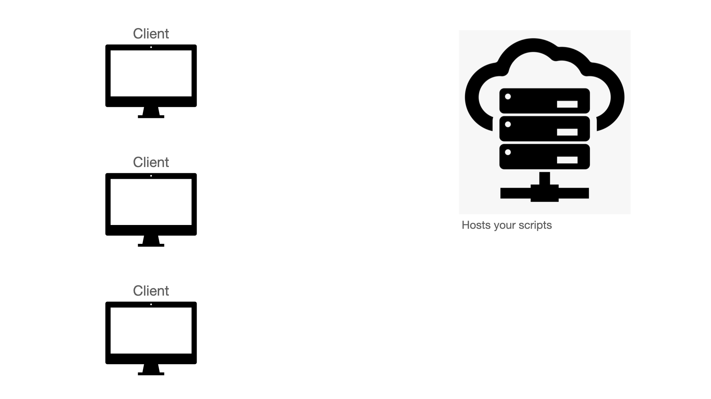
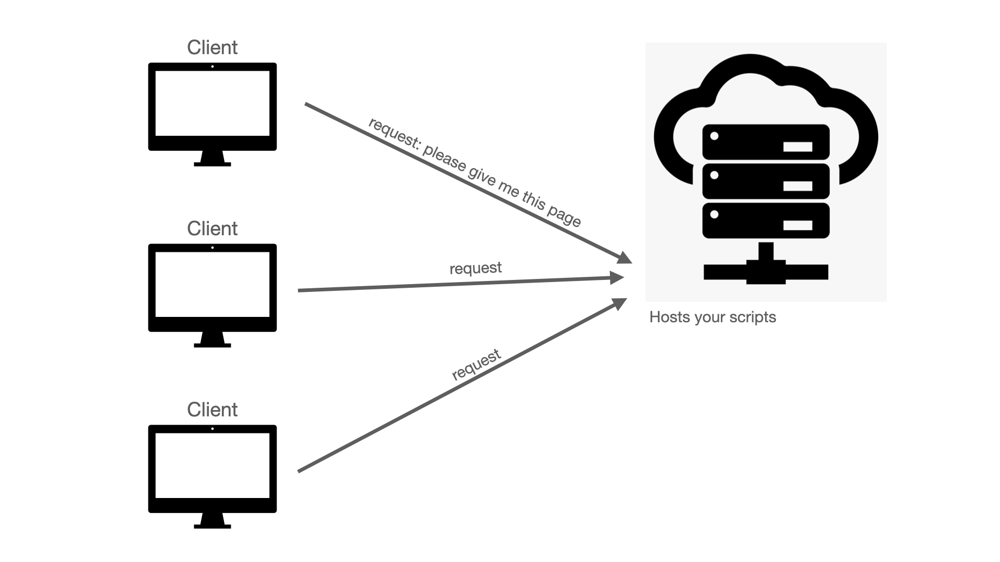
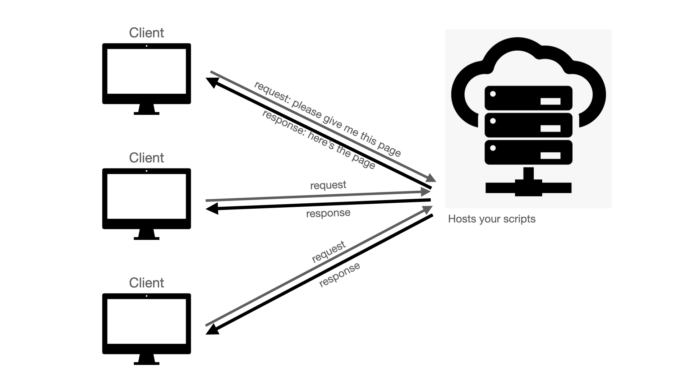
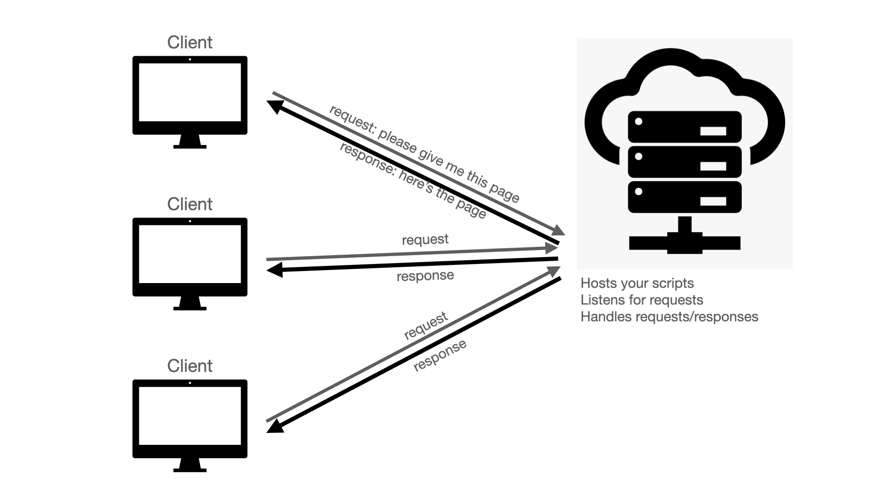
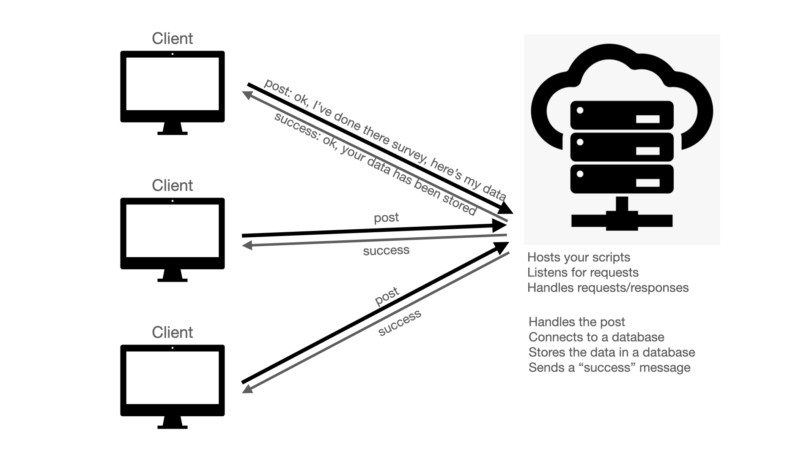

```{r, echo=F}
library(DiagrammeR)
```

# Coding a server with node.js

## Installing node

- We're only going to be needing it in 20 minutes' time, but may as well get it installed now

- [https://nodejs.org/](https://nodejs.org/en/)

- It's a javascript library for running a server, so first we're going to talk about what a server is

## Servers

- You've coded a survey. It's sitting on your laptop. How is anyone meant to take it?

- Something somewhere needs to host it for you. That thing is the server

## Servers

</img>

## Servers

</img>

## Servers

</img>

## Servers

</img>

## Servers

</img>

## Servers

</img>

## Review

What are:

- listen 

- request

- response

- post

## Servers

- 2 senses:
    1. A machine somewhere running code that is typically connected to the internet and active, able to handle lots of incoming traffic
    2. A script that listens for requests, handles them, as well as responses/posts/etc./...

- A server (sense 2) connected to a database can both live on a server (sense 1)

## Node.js

- Node.js is a library/engine for writing server scripts
- You can write the entire thing in plain JS but we're going to rely *heavily* on node libraries that do the hard work for us
- By now, have you installed node? 

&rarr; If you go to the terminal/command prompt and type "node" then you should see it starting... (control+c to quit)

## Node.js

- We're going to code a basic server that:
- *Listens* for requests
- *Gets* requests for specific pages
- *Responds* with the page in question
- When the experiment *posts* some survey data, the survey handles the post (we're only going to connect to a database in the next class)

## Set a server to listen

- Exercise 1: app.js
- Since we're going to be changing a lot, best to copy this outside the weekly_material folder
- You may be familiar with loading libraries in other languages with `import x` or `library(x)`
- In node, they're called modules, and they are loaded with `var x = require(x)`
- Though typically instead of `var`=variable we use `const`=constant (because we're not going to be changing the value of these constants)

## Set a server to listen

- Express is a JS library for creating apps/running servers
- We just need a couple lines of code to get a server going
&rarr; exercise 1

## Set a server to listen

- to run this script, type `node app.js`
- We get an error! `Error: Cannot find module 'express'`

- You need to install the relevant library first, using node package manager `npm install x`
- `npm` can also track everything going on with this app, which is useful, though we need to initialize it first: `npm init`
- It asks a bunch of questions. Just hit ENTER to use the default

## Set a server to listen

- Try run `node app.js` again
- Is it listening?
- Is it doing anything else?
- In a web browser, type "localhost:5000" in the address
- What's the error?
- How do we know there's actually a server there?

## Add a GET function

- The root path at a given link is just '/'
- Compare 'https://cvbers.com' with 'https://cvbers.com/research-streams/'
- So we need to add some code telling the server what to do when it gets a request at '/'


## Detour: node syntax

- One thing that is very common/slightly counterintuitive in node scripts is liberal use of functions (inside functions, as inputs to functions, appended to functions, ...)

```{javascript}
var function1 = function(inputA, inputB){...do something...}

function1(1, 4)
```

## Detour: node syntax

- One thing that is very common/slightly counterintuitive in node scripts is liberal use of functions (inside functions, as inputs to functions, appended to functions, ...)
- Basically, one of the inputs to a function can be another function, so:
  - function1: ...do something..,
  - function2: part of what you're doing is me

```{javascript}

var function2 = function(request, response){...do something else...}


function1('/', function2)

function1('/', function(...){...})
```

## Detour: node syntax

- I'm only mentioning this as an aside since you may see it in sample code
- In modern javascript, instead of `function(inputs){...}` you can type `(inputs) => {...}`
- I'll stick with the more familiar version for now though

## Add a GET function

- Recall: the server handles requests and sends responses (it does something: a function)
- This function needs to know 2 things: request and reponse

```javascript
app.get('/', functionHandlingRequestsAndResponses)
```

## Add a GET function

- Recall: the server handles requests and sends responses (it does something: a function)
- This function needs to know 2 things: request and reponse

```javascript
app.get('/', function(request, response){...})
```

## Add a GET function

- For now, we'll have the response *send* some html

```javascript
app.get('/', function(request, response){
  response.send("<p>Welcome!</p>")
})
```

&rarr; Create another GET pathway (e.g., `/info`) that sends some other html


## Refreshing with nodemon

- Go to `localhost:5000/info` 
- Nothing there!
- That's because the server started running the old code, so it's not running the new code yet...
- To have the server restart whenever you make changes, we can use `nodemon app.js` instead of `node app.js` but this needs the `nodemon` module
- So how do we include it?


## Add a GET function

- Obviously, we don't want to type the whole html for a page each time, so instead of:

```request.send(...some html...)``` 

we can use:

```request.render(...path to an existing html page ...)```

- But this requires a bit of extra stuff, so we'll skip it for now
- I'll provide you with a template that has all this extra stuff once we need it

## Setting options

- We set the app to listen on port 5000
- But once we upload this to the cloud (e.g., to Heroku) we don't know what port Heroku is going to assign to it
- So a common pattern is to: 
  1. See if the process environment (e.g., Heroku) is specifying a port
  2. If not, assign it 5000
  
- This is done with a javascript OR: `a OR b` is expressed as `a||b`
- In this case, if `a` exists/is found then it stops there. If not, proceeds to `b`.

```
var PORT = process.env.PORT || 5000
```

## Getting further info from the request

- You may have seen longer URLs that look like they contain all sorts of info
- They do! And that info can be extracted and used by the app
- These *queries* are part of the request
- `www.mypage.com/?key=value`

## Getting further info from the request

- For instance, the url can include some kind of ID token to track whover is making the request
- `www.mypage.com/?id=12345`
- You can then add lines to the `function(request,response){...add here...}` to extract this info from the request

## Getting further info from the request

```javascript
app.get("/", function(req, res){
  console.log(req.query.id)
})
```

&rarr; Get an ID string in the request

&rarr; Create an object `var ids = {id:name}` that contains the ID string and a made-up name

&rarr; Update the html string for the home page to greet that person by name

## Adding a post method

- This needs a bit more machinery to 
  - Pass the data between client and server 
  - Render the experiment script with all of its own libraries etc.
  
- So we're switching to a template I've already built

&rarr; exercise 2 (again, probably best to copy this outside weekly_material)

## Instructions for Exercise 2

&rarr; Add a console.log to the client script to print out the data

&rarr; Add a console.log to the server script to do the same; check that you're getting the right data

&rarr; Add an IF statement to check that there is some data and print a warning if not

&rarr; Add a request query that can track if this is a test run or the real experiment

&rarr; Look at how the trial_id is passed to the experiment when rendered, try pass a variable with the previous info (test run vs real experiment)

&rarr; Try make the multiple choice survey compulsory during a real experiment, but optional during a test run 

