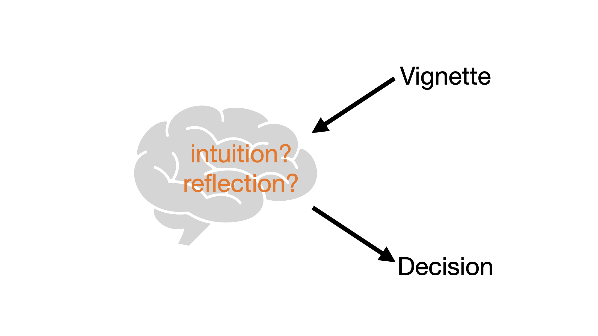
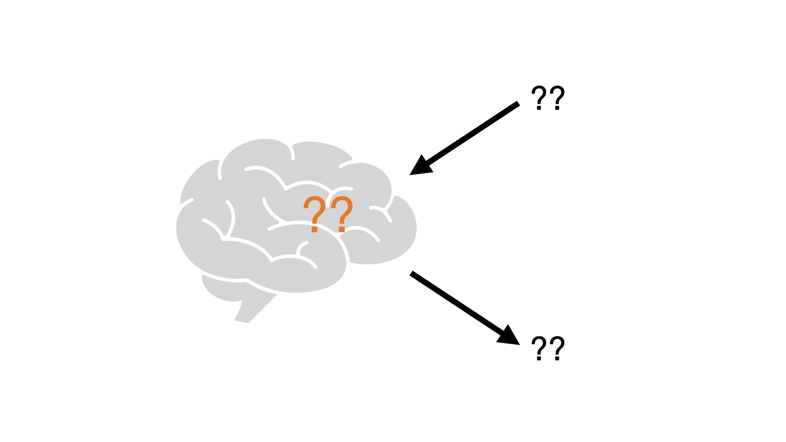
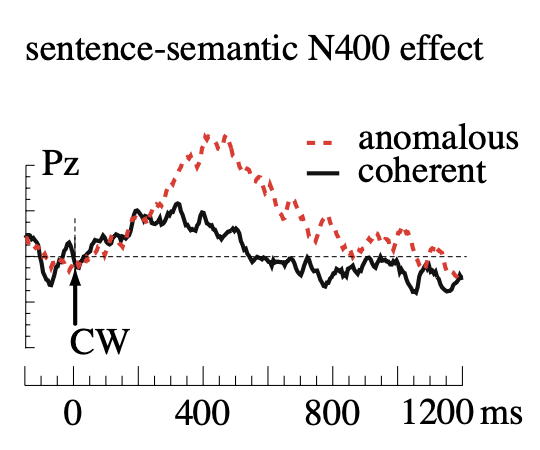
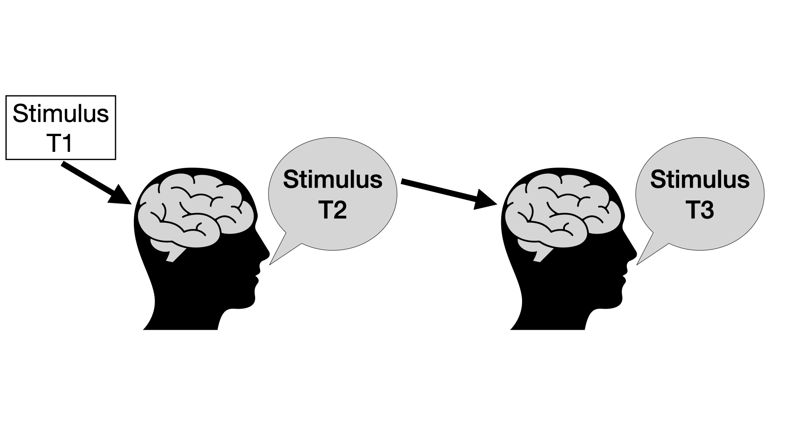
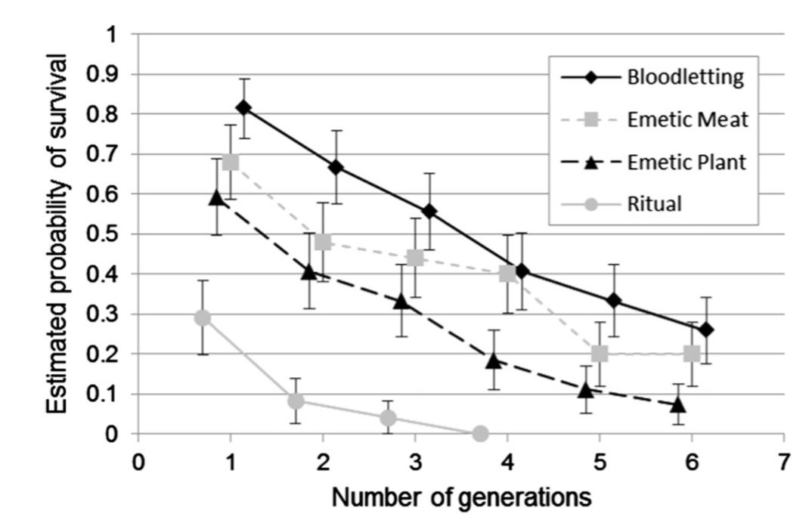
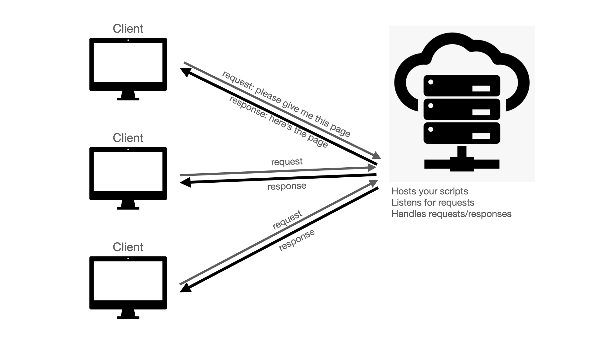
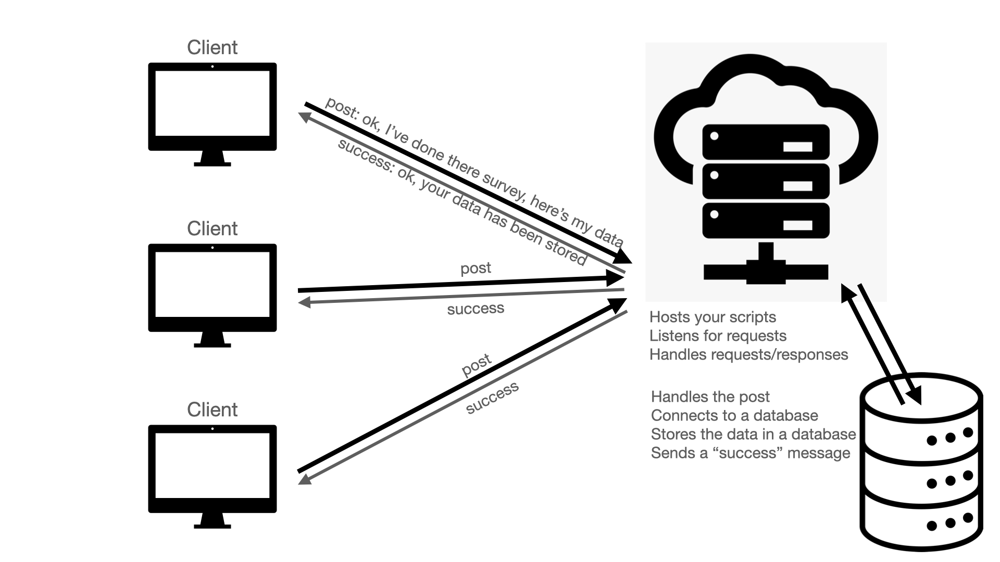

## Outline

- Going beyond <strike>intuitions</strike> vignettes
- Connecting to a database

# Theory: going beyond vignettes

## Going beyond vignettes

- Much of the research we've been discussing involves vignettes
- But these are just one specific tool with several limitations
  - Assumes much about what's been understood/processed and what the responses reveal
- We've been talking about how X-Phi interacts with cognitive science more broadly
- Cognitive science has *many* tools that X-Phi can (and does) use
- Today: 
  - Mention a few from Fischer, E. & Curtis, M. (2019). *Methodological advances in experimental philosophy.*. When I refer to Ch X in following slides, it means chapter X in this book. 
  - Then illustrate one from Cultural Evolution
  
## Going beyond vignettes

- Some of the themes to think about:
  - Concepts & representation
  - Automatic vs conscious processes
  - Learning/acquisition
  - Comprehension & production
  - Attention/eye movement
  - Decisions other than Likert/binary decisions
  - Cognitive biases
  
## Going beyond vignettes: X-Phi 2.0

</img>

## Going beyond vignettes: X-Phi 2.0

</img>

## Ch 1: Statistical learning

- One way to explain how we end up with the representations we have
  - I.e., it's mostly an account of acquisition
- Statistical learning: tracking frequencies/occurrences/probabilities
  - How do children learn where the words are in a stream of speech?
  - *imhappytoseeyou*
  - *ha* is often followed by *py*
  - *py* is not often followed by *to*
  
  &rarr; *happy* is a word; there's a word boundary between *happy* and *to*
  
## Ch 1: Statistical learning

- "These are *feps*" when shown 3 dalmatians
  - *fep* means dalmatian vs dog?
- I have one 6-sided and one 20-sided die
  - I tell you one of my die yielded throws 2 1 2 2 4 1 4 6 3 6 
  - This die has 6 or 20 sides?

&rarr; size principle

## Ch 1: Statistical learning

Ok, how do people acquire a concept like *knowledge* IF this means something like *infallible belief*?

- Analyse a corpus of child-directed speech
- Tag instances of $\phi$ in ['know', 'think', 'believe', ...] where the usage is something like "I $\phi$ but I might be wrong"" or "she $\phi$ but she's not sure"
- For "think": many occurences
- For "know": none

"the important point from the perspective of the learning theory is that this is the evidence that kids get. Given the absence of such qualifications on attributions of knowledge, it would be appropriate for a rational learner to select the infallibilist hypothesis."

## Ch 2: Psycholinguistics

- Much philosophy happens in language (maybe not thinking, but certainly articles, discussions, vignettes)
- Would be surprising if factors in language comprehension/production had nothing to tell us about philosophical decisions!

- Semantic memory: general world knowledge
- Things co-occurring tend to get associated (MOUSE activates CHEESE; BANK activates MONEY)
- [https://smallworldofwords.org/en/project/visualize](https://smallworldofwords.org/en/project/visualize)

## Ch 2: Psycholinguistics

- Strong associations &rarr; stereotypes or automatic inferences from **words** to **features**

- We speak slower than we draw such inferences 
- "inference is cheap, articulation is expensive" (Levinson, 2000)

&rarr; communication bottleneck

## Ch 2: Psycholinguistics

- We often skip mention of stereotypical features but make deviations from stereotypes explicit (e.g., secretary vs. male secretary)

- maxims apply both when producing and comprehending

&rarr; "Linguistic coding is to be thought of less like definitive content and more like interpretative clue" (Levinson, 2000)

## Ch 2: Psycholinguistics

Lots of measures:

- Plausibility (how plausible is it that tomatoes are red?)
- Frequency/Ranking (list features of tomatoes)
- Cloze probability (Complete this sentence: "Tomatoes are _____")
- Priming (after reading "tomato" how quickly do people decide if red is a word/non-word)
- Pupillometry (cognitive effort makes our eyes widen)
- Reading time measures (difficulty makes us slow down or even backtrack)
- EEG (can index semantic surprisal)


Hagoort & Berkum (2007) Beyond the sentence given. Phil Trans B

## Ch 2: Psycholinguistics

- Ok, so how is this relevant to philosophy?
  - Dominant vs non-dominant senses, e.g.: 'Mona sees the road' vs 'Josh sees the problem'
  - Dominant sense activates salient spatial schema: the road is in front of Mona 
 
  - Evidence (reading times, pupillometry) shows that the spatial schema is active even even when in appropriate (e.g., in the epistemic case)
  - People don't react the same to "Josh sees the problem" vs "Josh is aware of the problem"  
 
- The issue: philosophical examples/cases/vignettes/thought experiments often use words in special/exotic/non-dominant senses
- Readers may nonetheless make stereotypical inferences, which may affect intuitions

## Ch 3: Gaze

- Eye trackers track what people look at/for how long/fixation
- H: If people are making (e.g., moral) judgements, they will fixate on info supportive of that judgment/avoid info that is inconsistent/unsupportive

- Trolley problem: trolley is heading towards 5 people; can flip a switch to send it down another track, where it will hit 1 person
  - People more likely to fixate first and more often on beneficiary of their decision
- Baby problem: group hiding from attackers in cellar. Baby is trying to cry. Smother baby to save group? Let baby cry and cause group to be killed?
  - People more likely to fixate first on beneficiary; gaze avoids baby if chose to smother it

&rarr; Difficulty? Guilt?

&rarr; In any case, gives you data about decisions not available from just measuring their choice

## Ch 3: Gaze

- Have 2 similar scenarios; manipulate difficulty (clear choice vs ambiguous)
- Easy choice: people look at beneficiary
- Difficult choice: people avoid looking at non-beneficiary

&rarr; not just giving them info in a vignette and assume they're attending to all of it, and then making assumptions about their decision; rather seeing how much certain info is attended to/avoided while making that decision

&rarr; a strong (bi-directional) relationship between people's moral cognition and their attention to sensory information

&rarr; useful to measure non-conscious processes

## Transmission chain experiments

- Here, I'm not talking about intuitions in the philosophical sense
- I'm not even applying this to philosophical cases
- The point is just: this is a neat way to get at the cognitive biases that affect how people understand/represent certain cases/stimuli/vignettes


## Transmission chain experiments




## Transmission chain experiments

- Some ideas seem to be intuitive: blood letting; sun going around the earth
- We talked a bit about reaction times for the latter previously
- Today: a demonstration of the former


## Transmission chain experiments (Miton et al., 2015)

Seed: 

In the Amazonian forest there are still tribes that have had little contact with modern technology. Yanobala was born in one of these tribes, the Yamotaba. Yanobala has mastered the art of archery, and he has become one of the best hunters of the tribe. In order to marry the chief's daughter, who is a very beautiful woman, he has to bring back a bird with magnificent feather that is very rare and hard to catch. He's eager to go hunting, but for several days he has suffered from an incapacitating headache. *Yanobala goes to see the medicine man, who uses a sharp stone to cut Yanobala's temple and let some blood flow.* The day after, Yanobala feels better and he goes looking for the special bird. After days of hunting, he finds one, manages to kill it and to bring it back: he will finally be able to marry the chief's daughter.

Modified sentence in italics (ritual, emetic plant, not co-localized, accidental, ...)

## Transmission chain experiments (Miton et al., 2015)

Survival analysis: how many generations does the key sentence last?




## Transmission chain experiments

- Do you think many (any?) of these participants would actually say that bloodletting works?
   - Access to biases/amplifies biases
- Can manipulate salient features
- Indication of stability
- *Arguably* gets at universal cognitive mechanisms?
  - Not sure I buy it...

## Task 1:

- Pick one of the vignette studies from previous weeks
- Pick one of today's methods
- Imagine a way to combine them
- Reflect on what this might add to the study (what will this tell us, potentially, that a simple vignette survey might not)

# Practial: Databases

## Servers and databases

Last time we talked about the job of a server script



## Servers and databases

Today: what is the server going to do with some data it needs to store?



## Database types

- SQL: basically a collection of tables ([https://en.wikipedia.org/wiki/SQL](https://en.wikipedia.org/wiki/SQL))

Students

| student_ID | Class   | Grade |
|------------|---------|-------|
| 1223       | phil101 | A     |
| 1223       | phil103 | B     |
| 3546       | eng101  | A     |

Classes

| class_ID| Teacher |
|---------|---------|
| phil101 | Smith   |
| phil103 | Müller  |
| eng101  | Chen    |

## Database types

- NoSQL (e.g., MongoDB): can be various things, but here like an Object

Collection Students
```
{student_id: 1234, classes: [{phil101: A}, {phil103: B}]}
{student_id: 3456, classes: [{eng101: A}]}
```

Collection Classes
```
{class_id: phil101, teacher: Smith}
{class_id: phil103, teacher: Müller}
{class_id: eng101, teacher: Chen}
```

## 1: What type are we using?

Last time we printed out some trial data
```
{type: 'survey-likert', responses: [{name: q0, response: 6}, {name: q1, response: 7}]}
```

We can just plonk this in a MongoDB database

## 2: How to connect to the DB?

2 components needed

- A script that sets up a connection
- Some connection credentials (user ID, password)

## 2A: Connection script(s)

- I've written one you can use (and copy+paste for future use)
- The database connecting/saving is in the directory called "controllers"

&rarr; example_db

- A connection function is called at `app.js` lines 44-49

## 2B: Credentials?

- Set up via MongoDB website (organization > project > cluster > connect)
   1. Add a connection IP address (allow access from anywhere)
   2. Create a database user (e.g., experimentApp) + autogenerate password
   3. REMEMBER TO MAKE A NOTE OF THE PASSWORD SOMEWHERE
   4. Connect your application (select driver: node.js)

## 2B: Credentials?

Make note of the string provided by mongodb: 

- `mongodb+srv://<username>:<password>@<cluster>.<address>/<database>?<settings>`

- We need to update this string
  - When we create a user, mongodb.com has filled in most of it for us
  - Let's change the database to something more informative
  - Copy+paste the password we noted into the relevant place
- This will now be our connection string. KEEP IT SAFE

## 3: Letting the app see the credentials

- In the root, there's a file called `.env` 
- IF it's not there, create it (the dot in `.env` is important)
- We need to add a line giving this string a name (MONGODB_URI) and a value (the connection string we just copied)
  - `MONGODB_URI=<connection string>`
  - Save and exit
- The process running the script can now access any info via `process.env.MONGODB_URI`

## 4: How to get the app to save the data?

- Again, using existing scripts
- see `libraries/helper.js`
- see `public/views/experiment.ejs` right at the bottom

## 5: Checking it works

- Start up the up...
  - What are some of the steps you need to get started with a new app?

## Task 2

- Imagine we want to run a Transmission Chain experiment
- A user clicks on the link to start the experiment
- Write a series of (verbal) instructions that reflect what the app should do/know
- This will involve some calls to the database (given the nature of the experiment)

## Homework

- Readings from the syllabus (week 9)
  - Claidiere et al
  - One chapter from Fischer & Curtis